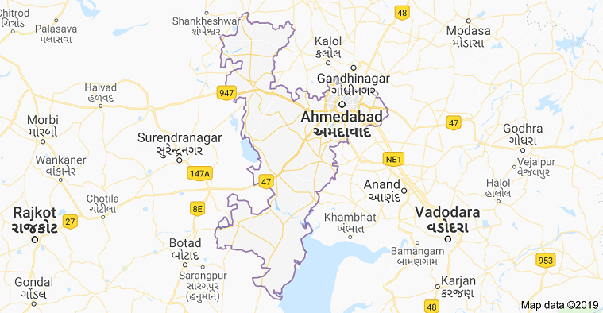

```{r,echo=FALSE,warning=FALSE,fig.align = "center"}
knitr::include_graphics("FOSSEE.png")
  

```


```{r,echo=FALSE,warning=FALSE,fig.align = "center"}

```
\newpage

\tableofcontents

\newpage

> Abstract

In this report, data from the various government departments of Coimbatore district were collected by visiting respective departments in person and by searching for required data on online government portals. Data included in this report are on **Population**, **Fair Price Shops**, **Electricity**,**Healthcare**,**Court** and **Rainfall**. Collected data was analyzed and conclusions were drawn. Analysis was done completely using a **Free-Libre / Open Source Software (FLOSS)** known as **'R'** as a part of **[FOSSEE](https://fossee.in/) Project** by **IIT Bombay** and **MHRD, Government of India.** [FOSSEE](https://fossee.in/) project is part of the National Mission on Education through ICT with the thrust area being adaptation and deployment of open source simulation packages equivalent to proprietary software, funded by MHRD, based at the Indian Institute of Technology Bombay (IITB).


\newpage

>#1.) Introduction


With total Area of 8087 sq.k.m. Ahmedabad is geographically at the centre of Gujarat, situated between 21.6 to 23.4 north latitude and 71.6 to 72.9 east longitude. Total population of District is 74,86,573 (2014).

Ahmedabad District is surrounded by Kheda District in the east, Mehsana in the north, Anand District in the south and Surendranagar in the west. 14 talukas of the District include 556 villages, 1 corporation, 1 cantonment area and 7 municipalities.


source: [@amd]

```{r,echo=FALSE,warning=FALSE,fig.align = "center"}

```

|                                     *Fig: Map of Ahmedabad district *

\newpage

>#2.) Population 

Ahmedabad is the largest city in the Indian state of Gujarat. It was formerly the capital of Gujarat and is still the judicial capital since the Gujarat High Court is located there. The estimated population of Ahmedabad in 2016 is over 7 million people in the city and approximately 8 million in the urban agglomeration.

This makes Ahmedabad the fifth largest city in India and the seventh largest metropolitan area. Forbes magazine ranked Ahmedabad as the third fastest growing city of the decade.

source: [@pop]

```{r,echo=FALSE,warning=FALSE,fig.align = "center"}
library(reshape2)
library(ggplot2)
#options(scipen=999)
population<-read.csv("population.csv")

ggplot(melt(population, id.vars="Year"), aes(x=Year, y=value/100000, fill=variable)) + 
  geom_bar(stat='identity', position='dodge') + 
  labs( title= "Population",x="Year",y="Population (in lakhs)",fill="") +
 theme(axis.text.x = element_text(angle=70, hjust=1)) 
 
```

###Conclusion 

The above bar plot concludes that the male population has always been more than the female population. The population in the district has always shown a growth trend. The growth in population got increased after the year 1951 and kept on increasing after that.

\newpage

> #3.) Fair Price Shops 

The Indian food security system was established by the Government of India under the Ministry of Consumer Affairs, Food and Public Distribution to distribute food and non-food items to India's poor at subsidised rates. This scheme was first started in February 1944, during the Second World War, and was launched in the current form in June 1947. Major commodities distributed include staple food grains, such as wheat, rice, sugar and essential fuels like kerosene, through a network of fair price shops (also known as ration shops) established in several states across the country. Food Corporation of India, a Government-owned corporation, procures and maintains the PDS (public distribution system). 

source: [@fps]

```{r,echo=FALSE,warning=FALSE,fig.align = "center"}
fps<-read.csv("fairprice.csv")
library(ggrepel)
theme_set(theme_bw())
p <- ggplot(fps, aes(x=fps$Year, y=fps$No_Shops), label = rownames(fps)) + 
  geom_point(size=3, color = "red") + 
  geom_segment(aes(x=fps$Year, 
                   xend=fps$Year, 
                   y=0, 
                   yend=fps$No_Shops) 
                   ) + 
  labs(title="Fair Price Shops",x="Year",
       y="Number of Fair Price Shops" 
  ) 
p


```

We can observe from the above plot that the number of Fair Price Shops remains consistent from the year 2013 to the year 2016. But a significant increase in the number of Fair Price Shops is observed in the year 2017.

###Ration Card

Ration card is an official certificate which is provided by all the State Governments to its citizen for purchasing subsidized provisions. The Gujarat Government has decided to issue new bar-coded ration cards as per the Food, Civil Supplies & Consumer Affairs Department. The objective of the issue of new ration card is to eliminate the duplicate and bogus ration cards and cover all eligible beneficiaries in the state of Gujarat.

source: [@rc]


```{r,echo=FALSE,warning=FALSE,fig.align = "center"}
theme_set(theme_bw())
p <- ggplot(fps, aes(x=fps$Year, y=fps$No_Rationcard_users/100000), label = rownames(fps)) + 
  geom_point(size=3, color = "green") + 
  geom_segment(aes(x=fps$Year, 
                   xend=fps$Year, 
                   y=0, 
                   yend=fps$No_Rationcard_users/100000) 
                   ) + 
  labs(title="Ration Card Holders",x="Year",
       y="Ration Card Holders in Lakhs" 
  ) 
p

```

We can observe from the above plot that the number of ration card holders remained consistent from the year 2013 to the year 2016. Then a slight increase in the number of ration card holders is observed in the year 2017. After that a significant increase in the number of ration card holders in observed in the year 2018.

###Conclusion

Both numbers of fair price shops and the number of ration card holders have shown a significant increase in the year 2017 and the year 2018.


\newpage


> #4.) Electricity

India's electricity sector is dominated by fossil fuels, and in particular, coal, which during the 2017-18
fiscal year produced about three-fourths of the country's electricity. However, the government is pushing
for increased investment in renewable energy. The National Electricity Plan of 2018, prepared by the
Government of India, states that the country does not need additional non-renewable power plants in the
utility sector until 2027, with the commissioning of 50,025 MW coal-based power plants under construction
and achieving 275,000 MW total installed renewable power capacity after the retirement of nearly 48,000
MW old coal-fired plants. 

source: [@el]

```{r,echo=FALSE,warning=FALSE}
ele<-read.csv("electricity.csv")
names(ele)<- gsub("\\.", " ", names(ele))

ggplot(melt(ele, id.vars='Year'), aes(x=Year, y=value/1000, fill=variable)) + 
  geom_bar(stat='identity', position='dodge') + 
  labs( title= "Electricity Consumption",x="Year",y="Electricity Consumption in kWh",fill="Sector") +
  theme(axis.text.x = element_text(angle=60, hjust=1)) +
  scale_x_discrete(limits=ele$Year)

```

###Conclusion

We can observe from the above bar plot that there was a very low consumption of electricity in both domestic and commercial & agriculture sector before the year 2016. After the year 2016 very high consumption of electricity is observed in both the sectors. In almost every year consumption in the commercial and agriculture sector is higher than the domestic sector. 

\newpage

> #5.) Healthcare

India has a vast health care system, but there remain many differences in quality between rural and urban
areas as well as between public and private health care. Despite this, India is a popular destination for
medical tourists, given the relatively low costs and high quality of its private hospitals.


```{r echo=FALSE,warning=FALSE,message=FALSE,error=FALSE}
doc<-read.csv("healthcare.csv")
theme_set(theme_bw())
ggplot(doc, aes(x=doc$Year)) + 
  geom_line(aes(y=doc$No_of_Doctors, col="Doctors")) + 
   
  labs(title="Number of Doctors",x="Year",y="Number of Doctors" ) +  # title and caption
  
  scale_color_manual(name="", 
                     values = c("Doctors"="#00ba38")) +  # line color
  theme(panel.grid.minor = element_blank())  # turn off minor grid
```


###Conclusion 

We can observe from the above graph that the number of doctors in the district kept on decreasing from the year 2013 and went lowest in the year 2015. After the year 2015, the number of doctors increased rapidly. After the year 2016, the number of doctors again started decreasing.

\newpage

> #6.) Court

The Indian Judiciary administers a common law system of legal jurisdiction, in which customs, precedents and legislation, all codify the law of the land. It has, in fact, inherited the legacy of the legal system established by the then colonial powers and the princely states since the mid-19th century, and has partly retained characteristics of practices from the ancient and medieval times. 

There are various levels of judiciary in India - different types of courts, each with varying powers depending on the tier and jurisdiction bestowed upon them. They form a strict hierarchy of precedence, in line with the order of the courts in which they sit, with the Supreme Court of India at the top, followed by High Courts of respective states with district judges sitting in District Courts and Magistrates of Second Class and Civil Judge (Junior Division) at the bottom.

source: [@cor]

###Number of Judges and Open Cases

```{r echo=FALSE,warning=FALSE,message=FALSE,error=FALSE}
court<-read.csv("courts.csv")
theme_set(theme_bw())
ggplot(court, aes(x=court$Year)) + 
  geom_line(aes(y=court$No_of_judges, col="No. of Judges")) + 
  geom_line(aes(y=court$No_open_cases/1000, col="No. of Open Cases (in Thousand)")) + 
   
  labs(title="Number of Judges and Open Cases",x="Year",y="Count" ) +  # title and caption
  
  scale_color_manual(name="", 
                     values = c("No. of Judges"="#00ba38","No. of Open Cases (in Thousand)"="red")) +  # line color
  theme(panel.grid.minor = element_blank())  # turn off minor grid
```

###Conclusion 

We observe from the above line chart that the number of open cases decreases but the number of judges increases from the year 2013 to the year 2014. Both number of open cases and the number of judges increases in the year 2015. The number of open cases kept on decreasing after the year 2015 and the number of judges remained consistent.

\newpage

> #7.) Rainfall

The rainfall averages are based on the daily rainfall measurements. Daily rainfall is defined as the 24-hour accumulated amount of rain from 8:00 AM on a given day until 8:00 AM the following day. Monthly rainfall is obtained by summing over the individual daily rainfalls. 
The average rainfall for a specific month is the average of 30 monthly values for the period 1981-2010. The calculation requires the existence of all the daily rainfall data. Since rainfall is highly variable from day to day (range 0 to 100mm or more), some of the monthly rainfall totals were obtained by interpolating for a few missing daily rain amounts in order to calculate the 1981-2010 averages.


source: [@rain]


```{r echo=FALSE,warning=FALSE,message=FALSE,error=FALSE}
options(scipen=999)
rain<-read.csv("rainfall.csv",header =TRUE)

g <- ggplot(rain, aes(rain$Year,rain$avg_rainfall))
g + geom_bar(stat="identity", width = 0.5, fill="tomato2") + 
      labs(title="Rainfall",x="Year",y="Average Rainfall in mm") +
  
     theme(axis.text.x = element_text(angle=60, vjust=0.6))+
     scale_x_discrete(limits=rain$Year)

```


###Conclusion

The above bar graph concludes that the district received minimum rainfall in the year 2016 and maximum rainfall in the year 2015. The rainfall trend has been quite random in recent years. 

\newpage


#References


