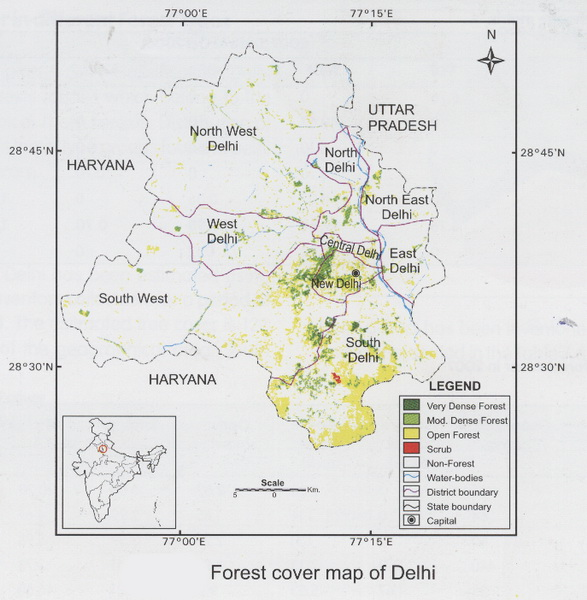

```{r,echo=FALSE,warning=FALSE,fig.align = "center"}

```

<center></center>


\newpage
\tableofcontents

```{r setup, include=FALSE}
knitr::opts_chunk$set(echo = TRUE)
```

\newpage
# **Abstract**

In this report, results from the analysis of publicly available data related to Delhi from various government online portals and statistical handbooks are represented in order to better understand the status of development in the district level. Various data variables were analyzed like Fair Price Shops, Pending cases in the District Court, Population, Literacy, Kisan Credit Card, Loan, just to name a few. Analysis is done completely using a **Free-Libre / Open Source Software (FLOSS)** known as **'R'** as a part of **[FOSSEE](https://fossee.in/) Project** by **IIT Bombay** and **MHRD, Government of India.** [FOSSEE](https://fossee.in/) project is part of the National Mission on Education through ICT with the thrust area being adaptation and deployment of open source simulation packages equivalent to proprietary software, funded by MHRD, based at the Indian Institute of Technology Bombay (IITB). Results from analysis were found to indicate increase in population, literacy rate, pending court cases, usage of networking devices and much more. Please refer to each data variable section in order to better understand the data used, analysis performed and results obtained for each of the respective variable.

\newpage
# **1. Gross District Domestic Product Report**

**Gross State Value Added (GSVA)** is a method of total output and income in the economy of a particular district. It gives us the rupee value for the amount of goods and services produced in an economy after deducting the cost of inputs and raw materials that have gone into the production of those goods and services.

**Gross State Domestic Product (GSDP)** gives the economic output from the consumers’ side. It is the sum of private consumption, gross investment in the economy, government investment, government spending and net foreign trade (difference between exports and imports).[1] 

This report is based on **Gross State Value Added (GSVA)** and **Gross State Domestic Product (GSDP)** economic activity of **Delhi district**. This includes revenue earned in 3 sectors which are as follows:

* Primary Sector - Agriculture, Forestry & Fishing, Crops, Livestock, Forestry & Logging, Fishing, Mining & Quarrying.
* Secondary Sector - Manufacturing, Electricity,  Gas & Water Supply & Other Utility Services, Construction.
* Tertiary Sector - Trade, Hotels & Restaurants, Trade & Repair Services, Hotel & Restaurants, Transport, Storage & Communication, Railways, Road transport, Water transport, Air Transport, Services incidental to transport, Real estate ownership of dwellings & professional services.


## Table

Here is the tabulation data for the **Gross District Domestic Product (GDDP)** of Delhi which is mainly judged on the basis of Primary, Secondary and Tertiary sectors :
```{r}
GDDP=read.csv("GDDP.csv")
GDDP
```

## Visualization
Let's analyse the pie charts for the years 2011 to 2016 :

Primary Sector maximum growth was in year 2016 which was about 20.87 % of the total. Secondary Sector maximum growth was in year 2016 which was about 23.04 % of the total. Primary Sector maximum growth was in year 2016 which was about 21.69 % of the total.

Net growth rate in 3 sectors from 2011 to 2016 can be visualized as:

a1= Net revenue in Primary sector; 
a2= Net revenue in Secondary sector; 
a3= Net revenue in Tertiary sector; 
```{r}
#Load Package--->plotrix
library(plotrix)
a1=c(1058350,1003608,1271412,1214345,1423370,1575064)
piepercent<- round(100*a1/sum(a1),2) 
lbls1=paste(piepercent,"%",sep="")
pie3D(a1,labels=lbls1,explode=0.1,labelcex=0.9,main="Primary Sector",col=rainbow(length(a1)))
legend("topright", c("2011","2012","2013","2014","2015","2016"),
       cex = 0.6,fill = rainbow(length(piepercent))) 

a2=c(3968117,4849828,5426347,5769350,6923445,8064896)
piepercent2<- round(100*a2/sum(a2),2)
lbls2=paste(piepercent2,"%",sep="")
pie3D(a2,labels=lbls2,explode=0.1,labelcex=0.9,main="Secondary Sector",col=rainbow(length(a2)))
legend("topright", c("2011","2012","2013","2014","2015","2016"),
       cex = 0.6,fill = rainbow(length(piepercent))) 

a3=c(25293696,28390396,31877623,36039554,39736762,44698016)
piepercent3<- round(100*a3/sum(a3),2)
lbls3=paste(piepercent3,"%",sep="")
pie3D(a2,labels=lbls3,explode=0.1,labelcex=0.9,main="Tertiary Sector",col=rainbow(length(a3)))
legend("topright", c("2011","2012","2013","2014","2015","2016"), 
       cex = 0.6,fill = rainbow(length(piepercent))) 
```

Let's see the together growth of GSVA (at basic prices) and GSDP (at market prices)
```{r}
market=c(3437.67,3912.38,4437.83,4229.20,4602.17,4982.17)
basic=c(3032.02,3424.38,3857.54,3699.15,3985.63,4316.87)
plot(market,type = "o", col = "red", xlab = "Consecutive Year (2012-2017)",
     ylab = "Revenue (in billions)",ylim=c(3000,5000),
     main = "Comparing GSVA (Basic Prices) and GSDP (Market Prices)")
lines(basic, type = "o", col = "blue") 
legend("topleft", c("Market Prices","Basic Prices"),cex = 0.85,col=c("red","blue"),lty=1)
```

## Analysis

We are going to analyse that how these 3 sectors are interrelated to each other. In this cor(), is termed as the correlation function which is used to find the relation between two variables.
```{r}
summary(GDDP)
#Net primary revenue from 2011 to 2016
a1=c(1058350,1003608,1271412,1214345,1423370,1575064)
#Net secondary revenue from 2011 to 2016
a2=c(3968117,4849828,5426347,5769350,6923445,8064896)
#Net tertiary revenue from 2011 to 2016
a3=c(25293696,28390396,31877623,36039554,39736762,44698016)
#Correlation between Primary and Secondary sector
cor(a1,a2)
#Correlation between Tertiary and Secondary sector
cor(a2,a3)
#Correlation between Primary and Tertiary sector
cor(a1,a3)
data=GDDP[1:33,3:8]
#pairs(data)
cor(data)
```
Here from the correlation data, the years which are consecutive to each other have values closer to 1. We can judge that the growth in these sectors are interrelated to each other.

## Summary

From the above report we can see that the 3 sectors as follows:

* Primary Sector
* Secondary Sector
* Tertiary Sector

All are dependent on each other very closely. Without the increment in the revenue of one sector other sectors can not developed.

So, in order to **increase the GSDP of Delhi, the government should equally work on all 3 sectors**


---
title: "Employment and Earnings"
author: "Meet Bhatnagar"
date: "27 February 2019"
output:
  html_document: default
  pdf_document: default
---
\newpage
# **2. Employment and Earnings**

Delhi is the capital city of India and is regarded as the heart of India. The city is popular for its enriched culture, heritage and sky touching buildings whereas on the outskirts of Delhi lies the villages and refuges of Bangladesh where lies the most of the poverty. 

Unemployment is also major factor of poverty because of the lack of skill-sets. All this results in the growing path towards the crime.

This report is based on 3 parameters of **Delhi**:

* Number of Below Poverty Line Households 
* Unemployment
* Crime rate 

## Table
Here is the tabulation data:

1. Table for Poverty line (In Lakhs) where we can see the data of Rural and Urban people corresponding to their percentage below poverty line with their respective year:
```{r}
pl=read.csv("Poverty_Line(Statistics).csv")
pl
```

2. Table for Poverty line (per Ca-pita per Month) which gives the data of average money earned by both Rural and Urban people per month in a particular year:
```{r}
plc=read.csv("Poverty_Line_Capita(Statistics).csv")
plc
```

3. Table for Employment and Unemployment Data (from June,2011-July,2012) with the corresponding data of how many are working in labor force and how many are out of labor force:
```{r}
emp=read.csv("Unemployment_and_Emploment(Statistics).csv")
emp
```

4. Table for Crime Rates:
```{r}
crime=read.csv("Crime(Statistics).csv")
crime
```

## Visualization

From the given graphs we can see that there is sudden increment in Growth Per Capita income from 2009 to 2012.

Growth in per Capita income can be shown as follows:
```{r}
par(mfrow=c(1,2))
H <- c(plc$Rural) 
M <- c("1973-74","1977-78","1983-85","1987-88","1993-94","1996-97","1999-00","2004-05","2009-10",
"2011-12")
barplot(H,names.arg = M,ylab = "Wages",col="blue",main="GrowthPerCapitaIncome(Rural)",las=2) 

P <- c(plc$Urban) 
Q <- c("1973-74","1977-78","1983-85","1987-88","1993-94","1996-97","1999-00","2004-05","2009-10",
"2011-12")
barplot(P,names.arg = Q,ylab = "Wages",col="red",main="GrowthPerCapitaIncome(Urban)",las=2)
```

Employment and Unemployment Rate in Delhi:

We can see from the below pie-charts that:

* In rural sector employment is 90.63 % and unemployment is 9.37 %.
* In urban sector employment is 95.61 % and unemployment is 4.39 %.
So, there is high employment rates in Delhi district.

a1= Employment vs unemployment in rural sector including male and female community

a2= Employment vs unemployment in urban sector including male and female community
```{r}
library(plotrix)

a1=c(70421+11901,8216+293)
piepercent<- round(100*a1/sum(a1),2) 
lbls1=paste(piepercent,"%",sep="")
pie3D(a1,labels=lbls1,explode=0.1,main="Rural",col=rainbow(length(a1)))
legend("topright", c("Employed","Unemployed"), cex = 0.8,fill = rainbow(length(piepercent))) 

a2=c(5095753+528042,204690+53227)
piepercent2<- round(100*a2/sum(a2),2)
lbls2=paste(piepercent2,"%",sep="")
pie3D(a2,labels=lbls2,explode=0.1,main="Urban",col=rainbow(length(a2)))
legend("topright", c("Employed","Unemployed"), cex = 0.8,fill = rainbow(length(piepercent2))) 
```

Rates of crime activities in Delhi:

Crime rates were at peak in 2015 but decreased in the consecutive year as the employments rates were increasing.

R= Recorded crimes against women
```{r}
R <- c(3515,4322,5367,4165) 
S <- c("2013","2014","2015","2016")
barplot(R,names.arg = S,xlab = "Year",ylab = "Number of cases",col="green",
        main="Molestation of women in recent years") 
```

## Analysis

We are going to analyse that how poverty line, employment and crime varies over the past years.

Poverty line analysis

pl = Poverty Line; 
plc = Poverty Line Capita
```{r}
summary(pl)
summary(plc)
data=pl[1:10,2:4]
data1=plc[1:10,2:3]
# Correlation between Rural and Urban
cor(data)
cor(data1)
```
Employment analysis

emp= Employment-Unemployment Data
```{r}
summary(emp)
data3=emp[1:4,2:5]
# Correlation between employment, unemployment, labour force and out of labour force
cor(data3)
```
Crime analysis

* Here from the summary below we can conclude that the mean of number of crime rates are increasing every year and this point can be made stronger by using the correlation function.
* In correlation function, we see that every year the number of crime rates closely depends on the previous year rates.
```{r}
summary(crime)
data4=crime[1:13,2:5]
# Correlation between crime rate over years
cor(data4)
```

## Summary

From the above report we can summarize that:

* **For Poverty line report:**
1. Most of people from urban sector are present in Poverty line in Delhi.
2. So, the government should work in the urban sector more to reduce these numbers.
3. While talking about Growth in per Capita income in urban and rural sector they both running hand in hand of each other.
  
* **For Employment and Unemployment report:**
1. Female employment in both urban and rural are very less as compared to the Male employment.
2. This is extremely good that in both sectors we have employment of more than 90 %.
  
* **For Crime report:**
1. Crime rates are increasing like in burglary rates from 2013 were 2,835 rises to 14,307 in 2016.
2. From the correlation plot, we can analyse that any crime, one or the other way they are interrelated to each other.
3. So, the government need to take measures to stop causality the society is taking.


---
title: "Fair Price Shops"
author: "Meet Bhatnagar"
date: "27 February 2019"
output:
  html_document: default
  pdf_document: default
---
\newpage
# **3. Fair Price Shops**

**Fair Price Shops** - Major commodities distributed include staple food grains, such as wheat, rice, pulses, sugar, and kerosene, through a network of fair price shops (also known as ration shops) established in several states across the country by the distribution (i.e. medium) of **ration cards**.[2]

This report is based on 2 parameters of **Delhi**:

* Availability and the number of fair price shops 
* Number of people with ration cards 

## Table

Here is the tabulation data for the number of ration card holders and number of fair price distribution in a particular year:
```{r}
FPS=read.csv("Fair_Price_Shops(Statistics).csv")
FPS
```

## Visualization

Ration Cards distribution across years:

There is a significant decline in the number of **ration cards** from 3,455 in year 2012-13 to 1,779 in year 2013-2014.

RC = Number of ration cards 
```{r}
RC <- c(FPS$Ration_Cards) 
M <- c("2011-12","2012-13","2013-14","2014-15","2015-16","2016-17")
barplot(RC,names.arg = M,ylim=c(0,3500),xlab = "Year",ylab = "Number of cards",col="blue",
        main="Ration Cards (In Thousands)")
```

Fair Price Shops Distribution:

The number of **fair of price shops** are gradually declining from 2011 to 2016.

P = Number of fair price shops
```{r}
P <- c(FPS$Fair_Price_Shops) 
Q <- c("2011-12","2012-13","2013-14","2014-15","2015-16","2016-17")
barplot(P,names.arg = M,xlab = "Year",ylim=c(0,2500),ylab = "Number of fair price shops",col="red",main="Fair Price Shops")
```

## Analysis

We are going to analyse that how ration cards and fair price shops varies over the past years. In what way they are inter-related to each other.

Fair price shops analysis:

From the summary we can find out that the mean of number of ration cards is about 2,362 and mean of number of fair price shop is about 2,370.
```{r}
summary(FPS)
#plot(FPS)
data=FPS[1:6,2:3]
# Correlation between Ration Cards and Fair Price Shops
cor(data)
```


## Summary

From the above report we can summarize that:

* Average number of ration cards and fair price shops in the community are 2362 and 2370 respectively.
* Maximum number of fair price shops were 2498 with 3455 ration card holders in year 2012-2013 and 2011-2012 respectively.
* The ration cards distribution and the number of fair price shops are both dependent on each other.
* In recent years, we can see there is a decline in the number of ration cards and fair price shops.

---
title: "Courts"
author: "Meet Bhatnagar"
date: "12 March 2019"
output:
  html_document: default
  pdf_document: default
---
\newpage
# **4. Courts**

There are in total 5 district courts in Delhi. There names are as follows:

* Tis Hazari
* Karkardooma
* Patiala House
* Rohini
* Dwarka


This report is based on 2 parameters of **Delhi**:

* Number of judges in district courts
* Number of cases open in district courts

## Table

The following data has been taken from the link [3]

Here is the tabulation data:

Number of Judges in District courts:

```{r}
judges=read.csv("Judges(Statistics).csv")
judges
```

Number of cases pending in District courts:

```{r}
cases=read.csv("Cases(Statistics).csv")
cases
```

## Visualization

```{r}
library(plotrix)

a1=c(cases$Number.of.Pending.cases)
piepercent<- round(100*a1/sum(a1),2) 
lbls1=paste(piepercent,"%",sep="")
pie3D(a1,labels=lbls1,explode=0.1,main="Pending cases distribution",col=rainbow(length(a1)))
legend("topright", c("Tis Hazari","Karkardooma","Patiala","Rohini","Dwarka"),
       cex = 0.5,fill = rainbow(length(piepercent)))

H <- c(judges$Number.of.Judges) 
M <- c("Tis Hazari","Kar.dooma","Patiala","Rohini","Dwarka")
barplot(H,names.arg = M,xlab = "Distirct Court",ylab = "Number of judges",col="green",
        main="Judges distribution in 5 different courts")  
```

## Analysis

We are analyzing that one judge is with what number of pending cases in each district court.

```{r echo=FALSE}
c=cases$Number.of.Pending.cases/judges$Number.of.Judges
sprintf("We can see that number of cases with each judge in Tis Hazari: %f",round(c[1],2))
sprintf("We can see that number of cases with each judge in Karkardooma: %f",round(c[2],2))
sprintf("We can see that number of cases with each judge in Patiala House: %f",round(c[3],2))
sprintf("We can see that number of cases with each judge in Rohini: %f",round(c[4],2))
sprintf("We can see that number of cases with each judge in Dwarka: %f",round(c[5],2))
```

## Summary

From the above report we can summarize that:

* Most of the pending cases are in Tiz Hazari court i.e. 1,01,016 (more than one lakh cases).
* We should recruit more judges in every district court in order to decrease the number of case to judge ratio.
* Dwarka court is under most pressure as each judge is having approximately 2,185 cases pending.

---
title: "Electricity"
author: "Meet Bhatnagar"
date: "2 March 2019"
output:
  html_document: default
  pdf_document: default
---
\newpage
# **5. Electricity**

The **Delhi Vidyut Board (DVB)** was formed by the Government of Delhi in 1997 for the purpose of generation and distribution of power to the entire area of NCT of Delhi except the areas falling within the jurisdiction of New Delhi Municipal Council and Delhi Cantonment Board. On 1 July 2002, The Delhi Vidyut Board was unbundled into six successor companies:[4]

* Delhi Power Company Limited (DPCL) - Holding Company
* Indraprastha Power Generation Company Limited (IPGCL) - GENCO
* Delhi Transco Limited (DTL) - TRANSCO
* BSES Rajdhani Power Limited (BRPL) - DISCOM for South & West Delhi
* BSES Yamuna Power Limited (BYPL) - DISCOM for Central & East Delhi
* North Delhi Power Limited (NDPL) - DISCOM for North Delhi

This report is based on 2 parameters of **Delhi**:

* Electricity Generated and Purchased from other states
* Electricity Consumed

## Table

Here is the tabulation data:

1. Table for amount of **Electricity generated and purchased from other state** for Delhi:
```{r}
EGP=read.csv("Elec_Gen_Purchased(Statistics).csv")
EGP
```

2. Table for amount of **Electricity consumed** in Delhi:
```{r}
EC=read.csv("Elec_Consumed(Statistics).csv")
EC
```

## Visualization

Electricity generated and purchased:

From the below graph we can see that our capacity to generate electricity locally is extremely low as comparing it to purchasing it from other states. We need to improve on our generation of electricity locally to control electric cut-off and overload problems. By generating locally we also increase our economy by stop buying electricity from other states.
```{r}
data=structure(list(A=c(4970,28472),B= c(4723,30006),C= c(4763,21044),
D= c(5941,24618),E=c(4013.52,24892.74)),
.Names = c("2013", "2014", "2015","2016","2017"),
class = "data.frame",row.names = c(NA, 2))
attach(data)
print(data)
colours <- c("orange","green")
barplot(as.matrix(data), main="Electricity Generated and Purchased",
xlab="Years",ylab = "Number of Electricity Units",ylim=c(0,34000),
 cex.lab = 0.8, cex.main = 1.1, beside=TRUE, col=colours)
legend("topright", c("Locally Generated","Purchased from Outside"), cex=0.95, bty="n", fill=colours)
```

Electricity consumed:

In this visualization, we can see that consumption of electricity is increasing from year 2013 to 2017 data in all domains such as domestic purposes, commercial purposes, industrial purposes, public water work and street lighting and other purposes.

EC = Electricity Consumed
```{r}
library(plotrix)
#par(mfrow=c(1,2))

a1=c(EC$X2013[1],EC$X2014[1],EC$X2015[1],EC$X2016[1],EC$X2017[1])
piepercent<- round(100*a1/sum(a1),2) 
lbls1=paste(piepercent,"%",sep="")
pie3D(a1,labels=lbls1,explode=0.1,main="Domestic purposes",col=rainbow(length(a1)))
legend("topright", c("2013","2014","2015","2016","2017"), cex = 0.7,fill = rainbow(length(piepercent))) 

a1=c(EC$X2013[2],EC$X2014[2],EC$X2015[2],EC$X2016[2],EC$X2017[2])
piepercent<- round(100*a1/sum(a1),2) 
lbls1=paste(piepercent,"%",sep="")
pie3D(a1,labels=lbls1,explode=0.1,main="Commercial purposes",col=rainbow(length(a1)))
legend("topright", c("2013","2014","2015","2016","2017"), cex = 0.7,fill = rainbow(length(piepercent))) 

#par(mfrow=c(1,2))
a1=c(EC$X2013[3],EC$X2014[3],EC$X2015[3],EC$X2016[3],EC$X2017[3])
piepercent<- round(100*a1/sum(a1),2) 
lbls1=paste(piepercent,"%",sep="")
pie3D(a1,labels=lbls1,explode=0.1,main="Industrial purposes",col=rainbow(length(a1)))
legend("topright", c("2013","2014","2015","2016","2017"), cex = 0.7,fill = rainbow(length(piepercent))) 

a1=c(EC$X2013[4],EC$X2014[4],EC$X2015[4],EC$X2016[4],EC$X2017[4])
piepercent<- round(100*a1/sum(a1),2) 
lbls1=paste(piepercent,"%",sep="")
pie3D(a1,labels=lbls1,explode=0.1,main="Public Water Work and Street Lighting",col=rainbow(length(a1)))
legend("topright", c("2013","2014","2015","2016","2017"), cex = 0.7,fill = rainbow(length(piepercent))) 

a1=c(EC$X2013[5],EC$X2014[5],EC$X2015[5],EC$X2016[5],EC$X2017[5])
piepercent<- round(100*a1/sum(a1),2) 
lbls1=paste(piepercent,"%",sep="")
pie3D(a1,labels=lbls1,explode=0.1,main="Other purposes",col=rainbow(length(a1)))
legend("topright", c("2013","2014","2015","2016","2017"), cex = 0.7,fill = rainbow(length(piepercent))) 
```

## Analysis

We are analyzing that how the energy locally generated vs purchased from other state over the past years can be viewed by this scatter-plot.

EGP = Electricity Generated and Produced
```{r}
# scatter plot
scatter.smooth(x=c(EGP$X2013[1],EGP$X2014[1],EGP$X2015[1],EGP$X2016[1],EGP$X2017[1]), y=c(EGP$X2013[2],  
                                                                                          EGP$X2014[2],EGP$X2015[2],EGP$X2016[2],EGP$X2017[2]),
xlab="Locally generated",ylab="Purchased from other State", 
main="Electricity production (In Million Units)")  
```

We are analyzing that how the energy is consumed over the past years and can be understood with this summary. We got that there is the minimal consumption of energy in the public and street lighting sector and highest energy consumption for the domestic usage. The median energy consumption is for the commercial sector in Delhi.
```{r}
summary(EC)
plot(EC)
data=EC[1:5,1:5]
# Correlation between consumption of electricity for different purposes over the past years
cor(data)
```


## Summary

From the above report we can summarize that:

1. We need to do tremendous work in order to generate your own electricity, to be self dependent.
2. We also need to keep in mind that with increasing technology, there is a continuous demand of electricity.
3. From the correlation plot we can judge that electricity consumption by domestic purposes, commercial purposes and industrial purposes are all interrelated to each other.

---
title: "Healthcare"
author: "Meet Bhatnagar"
date: "28 March 2019"
output:
  html_document: default
  pdf_document: default
---
\newpage
# **6. Healthcare**

Health care or healthcare is the maintenance or improvement of health via the prevention, diagnosis, and treatment of disease, illness, injury, and other physical and mental impairments in people. Health care is delivered by health professionals (providers or practitioners) in allied health fields. Physicians and physician associates are a part of these health professionals. Dentistry, midwifery, nursing, medicine, optometry, audiology, pharmacy, psychology, occupational therapy, physical therapy and other health professions are all part of health care. It includes work done in providing primary care, secondary care, and tertiary care, as well as in public health.[5]

This report is based on 2 parameters of **Delhi**:

* Number of MBBS doctors
* Prevalent diseases in Delhi

## Table

Here is the tabulation data:

Number of MBBS Doctors in Delhi which are of two categories i.e. Allopathic Doctors and Dental Surgeons:

The following data has been taken from the link [6]
```{r}
doctors=read.csv("Doctors(Statistics).csv")
doctors
```

Prevalent diseases in Delhi:

The following data has been taken from the link [7]

* M-Malaria
* ADD-Acute Diarrhoeal Diseases
* ARI-Acute Respiratory Infection
* VD-Viral Hepatitis
```{r}
diseases=read.csv("Diseases(Statistics).csv")
diseases
```

## Visualization

From these we can analyse that till 2009 number of dental surgeons (i.e. 6,280) were more than allopathic doctors but after that the number of allopathic doctors increased dramatically over the years. According to the data, final number of allopathic doctors are pretty more than dental surgeons.

Types of Doctors details:
```{r}
data=structure(list(A=c(5050,5720),B= c(5843,6280),C= c(6748,6280),
D= c(7754,6280),E=c(8700,6280),F=c(9773,7642),G=c(10932,7642)),
.Names = c("Till 2008", "Till 2009", "Till 2010","Till 2011", 
"Till 2012","Till 2013","Till 2014"),class = "data.frame",row.names = c(NA, 2))
attach(data)
#print(data)
colours <- c("red","green")
barplot(as.matrix(data), main="Doctors in Delhi",
ylab = "Number of Doctors",ylim=c(0,11000),
 cex.lab = 0.8, cex.main = 1.1, beside=TRUE, col=colours,las=2)
legend("topleft", c("Allopathic Doctors","Dental Surgeons"), cex=0.95, bty="n", fill=colours)
```

## Analysis

We are analyzing the number of doctors and which disease is dominant in Delhi over the past years.

```{r}
summary(doctors)
summary(diseases)
```

## Summary
  
From the above report we can summarize that:

* There are in **total 10,932 MBBS doctors**.
* **Acute diarrhoeal diseases** and **acute respiratory infection** are prevalent diseases in Delhi as it contains the most number of causes and death tolls.

---
title: "Tourism"
author: "Meet Bhatnagar"
date: "5 March 2019"
output: html_document
---
\newpage
# **7. Tourism**

**Delhi Tourism**, a government undertaking facilitating tourism since 1975 will take you to a guided tour of the Delhi through this website which explores the wonders of this city be it its heritage, the art and crafts, the diverse cuisine and culture.

A symbol of the country’s rich past and thriving present, Delhi is a city where ancient and modern blend seamlessly together. It is a place that not only touches your pulse but even fastens it to a frenetic speed. Home to millions of dreams, the city takes on unprecedented responsibilities of realizing dreams bringing people closer and inspiring their thoughts.[8]

This report is based on 3 parameters of **Delhi**:

* Tourist destinations number of attractions 
* Number of tourists in a year 
* Total revenue from tourism in a year 

## Table

Here is the tabulation data:

Popular Tourist destinations:
```{r}
TD=read.csv("Tourist_Destination(Statistics).csv")
TD
```

Number of tourists in a year:
```{r}
TT=read.csv("Total_Tourist(Statistics).csv")
TT
```
Total revenue from tourism in various years:
```{r}
TR=read.csv("Tourism_Revenue(Statistics).csv")
TR
```

## Visualization

TD= Tourist destinations; 
TT= Total number of tourist in a year; 
TR= Total revenue from tourism in a year
```{r}
v=TT$Total.Domestic.Tourists[1:12]
t=TT$Total.Foreign.Tourists[1:12]
plot(v,type = "o", col="red",xlab ="Month",ylab="Tourist",ylim = c(36000,1300000),main="Number of tourists in year 2009-2010")
lines(t,type = "o", col="blue")
legend("topright", c("Domestic","Foreign"),cex = 0.65,col=c("red","blue"),lty=1)
```
```{r}
v=TR$X2016[1:12]
t=TR$X2015[1:12]
plot(t,type = "o", col="red",xlab ="Month",ylab="Revenue",ylim=c(9000,16700),
     main="Comparing revenue generated in 2015 and 2016")
lines(v, type = "o", col = "blue")
legend("topleft", c("Revenue 2015","Revenue 2016"),cex = 0.65,col=c("red","blue"),lty=1)
```

## Analysis

We are analyzing on Number of local vs foreign tourists, Tourist destination and relation between Total revenue earned over the past years.

```{r}
summary(TT)
summary(TR)
data=TR[1:11,2:6]
# Correlation between Total revenue earned over the past years
cor(data)
```

## Summary

From the above report we can summarize that:

* **Tourist destinations number of attractions:**
1. There are in total 46 places approved by Delhi government for the domestic as well as foreign tourists to visit.

* **Number of tourists in year 2009-2010:**
1. The number of tourists are increasing yearly.
2. We can see that the number of tourists increased significantly in winter session.
3. There were in total 1,31,56,684 (more than 131 lakhs) domestic tourist and 8,59,956 (more than 8 lakhs) international tourist in Delhi.
  
* **Total revenue from tourism in a year:**
1. The revenue earned is increasing year-wise.
2. As from cor plot, The revenue earned also depends strongly on the previous year earned revenue and the number of tourists visited.

---
title: "Population and Education Data"
author: "Meet Bhatnagar"
date: "26 March 2019"
output: html_document
---
\newpage
# **8. Population and Education Data**

Private schools in Delhi—which use either English or Hindi as the language of instruction—are affiliated to one of three administering bodies, the Council for the Indian School Certificate Examinations (CISCE), the Central Board for Secondary Education (CBSE) or the National Institute of Open Schooling (NIOS). In 2004–05, approximately 15.29 lakh (1.529 million) students were enrolled in primary schools, 8.22 lakh (0.822 million) in middle schools and 6.69 lakh (0.669 million) in secondary schools across Delhi. Female students represented 49 % of the total enrollment. The same year, the Delhi government spent between 1.58 % and 1.95 % of its gross state domestic product on education.[9]

This report is based on 2 parameters of **Delhi**:

* Population of Delhi
* Literate persons in Delhi

## Table

Here is the tabulation data:

Population of Delhi:

In this table we can see that how much males and females, according to their age groups live in rural and urban part of Delhi.
```{r}
ppl=read.csv("Population_Statistics.csv", stringsAsFactors = FALSE)
ppl
```

Literate persons in Delhi:

In this table we can see that how much literate males and females, live in different sub-divisions of Delhi.
```{r}
lit=read.csv("Literate(Statistics).csv")
lit
```

## Visualization

Distribution of Population in Delhi:

From the below pie chart we can analyse the following things:

* Most of the Delhi population lives in urban part which combines to 97.51 % of the total population.
* Whereas the rural part comprises of only 2.49 % of the total Delhi population.

```{r}
a1=c(sum(ppl$Male_R),sum(ppl$Female_R),sum(ppl$Male_U),sum(ppl$Female_U))
piepercent<- round(100*a1/sum(a1),2) 
lbls1=paste(piepercent,"%",sep="")
pie3D(a1,labels=lbls1,explode=0.1,main="Population distribution",
col=rainbow(length(a1)))
legend("topright", c("Male Rural","Female Rural",
"Male Urban","Female Urban"),cex = 0.7,fill = rainbow(length(piepercent)))
```

Literate persons in Delhi:

The graph shows that how in 10 different parts of Delhi the distribution of literate males and females in the society.
```{r}
M=lit$Literate.Male.
F=lit$Literate.Female.
plot(M,type = "o", col = "red", xlab = "Portion of Delhi", 
ylab = "Population",ylim=c(0,7200000),main = "Literate Population Distribution")
lines(F, type = "o", col = "blue")
legend("topright", c("Literate Male","Literate Female"),cex = 0.85,col=c("red","blue"),lty=1)
```

## Analysis

We are analyzing the number of literate persons(Male-Female), population(Female Rural-Female Urban) of the district by using the linear regression. Linear regression is used to compare the two variables together that how their graph is plotted, their slope (+ve or -ve) or the intercept on the axis.
```{r}
#summary(ppl)
# Scatter plot of population of literate
#plot(ppl)
#summary(lit)
lm(lit$Literate.Male. ~ lit$Literate.Female.)
lm(ppl$Female_R ~ ppl$Female_U)
```

## Summary

From the above report we can summarize that:

* Most of the literate population lives in NCT region of Delhi i.e. Male - 71,94,856 (more than 71 lakhs) and Female - 55,42,911 (more than 55 lakhs).
* Most of the the population lives in urban region of Delhi (i.e. 97.51 % of total population of Delhi).
* Literate male and female are dependent on each other in increasing graph pattern.
* Form the above linear regression, female urban is very less dependent on female rural.

---
title: "Industries"
author: "Meet Bhatnagar"
date: "24 March 2019"
output: html_document
---
\newpage
# **9. Industries**

An **industry** is a place where there is production of goods or related services within an economy. The major source of revenue of a group or company is the indicator of its relevant industry. When a large group has multiple sources of revenue generation, it is considered to be working in different industries. Manufacturing industry became a key sector of production and labor in European and North American countries during the Industrial Revolution, upsetting previous mercantile and feudal economies. This came through many successive rapid advances in technology, such as the production of steel and coal.[10]

This report is based on 2 parameters of **Delhi**:

* **Number of Industries**
* **Type of industries:**  According to Labour, Raw materials and Ownership 

## Table

Here is the tabulation data for the years 2014 - 2016:

Number and types of factories:
```{r}
nf=read.csv("Number_Factories(Statistics).csv")
nf
```

Number of workers in each type of factory:
```{r}
workers=read.csv("Workers(Statistics).csv")
workers
```

## Visualization

```{r}
data=structure(list(A=c(330,333,340),B= c(46,44,44),C= c(2033,2012,2013),
D= c(265,266,269),E=c(765,771,776),F=c(298,298,300),G=c(666,666,662),H=c(295,291,290)
,I=c(82,82,82),J=c(525,523,519),K=c(1913,1890,1890),L=c(104,104,109)
,M=c(73,95,91),N=c(9,9,9),O=c(17,17,18),P=c(540,550,556)
,Q=c(1007,1003,1000)),
.Names = c("Food", "Beverages", "Textiles",
"Wood","Paper","Leather","Plastic","Chemical"
,"Non-metal","Basic Alloy","Metal","Electricity",
"Wholesale","Defense","Sanitary","Repair",
"Others"),las=1,class = "data.frame",row.names = c(NA, 3))
attach(data)
#print(data)
colours <- c("red","green", "orange")
barplot(as.matrix(data), main="Factories distribution for types of products",ylab = "Number of Factories",ylim=c(0,2200),
 cex.lab = 0.8, cex.main = 1.1, beside=TRUE, col=colours,las=2)
legend("topright", c("2014","2015","2016"), cex=1.1, bty="n", fill=colours)
```

## Analysis

We are analyzing the amount of factories available and the workers working in each factories.
```{r}
summary(nf)
summary(workers)
```

## Summary

From the above report we can summarize that:

* Highest number of factories in Delhi are for textiles products and have decreased over the years from 2033 in year 2014 to 2013 in year 2016.
* There are very few Public Administration and Defense Services factories (i.e. 9 only) in Delhi and these are not being developed i.e stagnant over the years. 
* There is a majority a workers working in factories to manufacture Textiles products i.e. 1,40,408 (more than one lakh forty thousand) in year 2016.
* There is a significant decrements in the number of workers in Sanitary services over the years.
* The second most place for the workers in Delhi is the Metal products factory.

---
title: "Education"
author: "Meet Bhatnagar"
date: "23 March 2019"
output: html_document
---
\newpage
# **10. Education**

Education is the process of facilitating learning, or the acquisition of knowledge, skills, values, beliefs, and habits. Educational methods include storytelling, discussion, teaching, training, and directed research. Education frequently takes place under the guidance of educators, however learners may also educate themselves. Education can take place in formal or informal settings and any experience that has a formative effect on the way one thinks, feels, or acts may be considered educational. The methodology of teaching is called pedagogy.

Formal education is commonly divided formally into such stages as preschool or kindergarten, primary school, secondary school and then college, university, or apprenticeship.

This report is based on 4 parameters of **Delhi**:

* Number of:  Schools, Colleges and Higher education institutes, Universities 
* Students studying (Male/Female) 
* Teachers 
* Number of Agriculture universities/colleges 

## Table

Here is the tabulation data:

Number of Schools:
```{r}
sch=read.csv("Schools(Statistics).csv")
sch
```

Number of School Students:

B-Boys;  G-Girls
```{r}
ss=read.csv("Students_School(Statistics).csv")
ss
```

Number of School teacher:

M-Male;  F-Female
```{r}
d=read.csv("Teachers_School(Statistics).csv")
d
```

Number of College Students and Teachers:

B-Boys;          MT-Man Teacher

G-Girls;         WT-Woman Teacher
```{r}
c=read.csv("Students_Teacher_College(Statistics).csv")
c
```

Number of Universities:

B-Boys; 
G-Girls; 
Co-Edn.-Co-Education
```{r}
e=read.csv("University(Statistics).csv")
e
```

## Visualization

Schools distribution in Delhi:
```{r}
data=structure(list(A=c(1427,463,600,2581,51),B= c(1504,458,564,2580,49),C= c(1627,389,728,2657,52),
                    D= c(1674,385,933,2766,40),
                    E=c(1684,393,940,2742,37)),
.Names = c("2011-2012", "2012-2013", "2013-2014","2014-2015", 
"2015-2016"),class = "data.frame",row.names = c(NA, 5))
attach(data)
print(data)
colours <- c("red","green", "orange","yellow","blue")
barplot(as.matrix(data), main="  Educational Institutions in Delhi",
xlab="Years",ylab = "Number of Students",ylim=c(0,3800),
 cex.lab = 0.8, cex.main = 1.1, beside=TRUE, col=colours)
legend("topleft", c("Sr. Secondary","Secondary","Middle","Primary","Pre Primary"), cex=0.75, 
       bty="n", fill=colours)
```

## Analysis

We are analyzing strength of students in schools and universities and the amount of students available to one teacher.
```{r}
summary(ss)
plot(ss)
```

## Summary

From the above report we can summarize that:

* Pre primary schools decreased form 51 in year 2011 to 35 in year 2016.
* Most of our students are in Primary Schools approx. more than 2500 in every considering year.
* Ratio of College Student to Professor is very high. This ratio should be reduced.
* Colleges for Professional Education(Co-Edn) are maximum in Delhi i.e. 94 in year 2016.

---
title: "Green Coverage"
author: "Meet Bhatnagar"
date: "12 March 2019"
output:
  html_document: default
  pdf_document: default
---
\newpage
# **11. Green Coverage**

A forest is a large area dominated by trees. Hundreds of more precise definitions of forest are used throughout the world, incorporating factors such as tree density, tree height, land use, legal standing and ecological function. According to the widely used Food and Agriculture Organization definition, forests covered 4 billion hectares (9.9×109 acres) (15 million square miles) or approximately 30 percent of the world's land area in 2006.

Forests are the dominant terrestrial ecosystem of Earth, and are distributed around the globe. Forests account for 75% of the gross primary production of the Earth's biosphere, and contain 80% of the Earth's plant biomass. Net primary production is estimated at 21.9 gigatonnes carbon per year for tropical forests, 8.1 for temperate forests, and 2.6 for boreal forests.

Forests at different latitudes and elevations form distinctly different ecozones: boreal forests around the poles, tropical forests around the Equator, and temperate forests at the middle latitudes. Higher elevation areas tend to support forests similar to those at higher latitudes, and amount of precipitation also affects forest composition.

Human society and forests influence each other in both positive and negative ways.[8] Forests provide ecosystem services to humans and serve as tourist attractions. Forests can also affect people's health. Human activities, including harvesting forest resources, can negatively affect forest ecosystems.[11]

This report is based on 3 parameters of **Delhi**:

* Forest cover
* Average temperature
* Pollution parameters

## Table

Here is the tabulation data:

Reserved forest in Delhi:

The following data has been taken from the link [12]
```{r}
forest=read.csv("Forest(Statistics).csv")
forest
```

Temperature PERIOD: 1981-2010:

The following data has been taken from the link [13]
```{r}
temp=read.csv("Temperature(Statistics).csv")
temp
```

Pollution parameter:

The following data has been taken from the link [14]
```{r}
pollution=read.csv("Pollution(Statistics).csv")
pollution
```

## Visualization

Here is the image of Forest Cover of Delhi [15]:



Forest Distribution:
```{r}
library(plotrix)

a1=c(forest$Area)
piepercent<- round(100*a1/sum(a1),2) 
lbls1=paste(piepercent,"%",sep="")
pie3D(a1,labels=lbls1,explode=0.1,labelcex=0.9,main="Forest area distribution",col=rainbow(length(a1)))
legend("topright", c("Northern Rigid Forest","Central Rigid Forest","South-Central Rigid Forest",
"Southern Ridge Forest"), cex = 0.63,fill = rainbow(length(piepercent)))
```

Temperature variation over past years:
```{r}
Min=temp$Daily.Min.
Max=temp$Daily.Max
plot(Min,type = "o", col = "red", xlab = "Month (Jan-Dec)", ylab = "Temperature",ylim=c(0,42),
     main = "Temperature variation PERIOD: 1981-2010")
lines(Max, type = "o", col = "blue") 
legend("topright", c("Minimum Temperature","Maximum Temperature"),cex = 0.7,col=c("red","blue"),lty=1)
```

Pollution variation over past years:
```{r}
#par(mfrow=c(2,2))
p=pollution$X2014[1:3]
q=pollution$X2015[1:3]
r=pollution$X2016[1:3]
s=pollution$X2017[1:3]
plot(p,type="o",xlab="SO2 (Min-Max-Avg)",ylab="Particles(ug/m^3)",main="SO2 Analysis",pch=8,
ylim=c(0,40),col="darkgreen", cex=1.5)
points(q, pch = 2, cex=1.5, lwd=2) 
points(r,pch=20,col="red")
points(s,pch=25,col="blue")
legend("topright", legend = c("2014","2015","2016","2017"), bty = "n",lwd = 2, cex = 1.2,
col = c("darkgreen","black","red","blue"),pch = c(8,2,20,25))

p=pollution$X2014[4:6]
q=pollution$X2015[4:6]
r=pollution$X2016[4:6]
s=pollution$X2017[4:6]
plot(p,type="o",xlab="NO2 (Min-Max-Avg)",ylab="Particles(ug/m^3)",main="NO2 Analysis",pch=8,
     ylim=c(20,210),col="darkgreen", cex=1.5)
points(q, pch = 2, cex=1.5, lwd=2) 
points(r,pch=20,col="red")
points(s,pch=25,col="blue")
legend("topright", legend = c("2014","2015","2016","2017"), bty = "n",lwd = 2, cex = 1.2,
       col = c("darkgreen","black","red","blue"),pch = c(8,2,20,25))

p=pollution$X2014[7:9]
q=pollution$X2015[7:9]
r=pollution$X2016[7:9]
s=pollution$X2017[7:9]
plot(p,type="o",xlab="PM<=10 (Min-Max-Avg)",ylab="Particles(ug/m^3)",main="PM<=10 Analysis",pch=8,
     ylim=c(38,820),col="darkgreen", cex=1.5)
points(q, pch = 2, cex=1.5, lwd=2) 
points(r,pch=20,col="red")
points(s,pch=25,col="blue")
legend("topright", legend = c("2014","2015","2016","2017"), bty = "n",lwd = 2, cex = 1.2,
       col = c("darkgreen","black","red","blue"),pch = c(8,2,20,25))

p=pollution$X2014[10:12]
q=pollution$X2015[10:12]
r=pollution$X2016[10:12]
s=pollution$X2017[10:12]
plot(p,type="o",xlab="PM<=2.5 (Min-Max-Avg)",ylab="Particles(ug/m^3)",main="PM<=2.5 Analysis",pch=8,
     ylim=c(0,290),col="darkgreen", cex=1.5)
points(q, pch = 2, cex=1.5, lwd=2) 
points(r,pch=20,col="red")
points(s,pch=25,col="blue")
legend("topright", legend = c("2014","2015","2016","2017"), bty = "n",lwd = 2, cex = 1.2,
       col = c("darkgreen","black","red","blue"),pch = c(8,2,20,25))
```

##Analysis

We are analyzing relation between temperature, amount of forest  cover left and pollutants level. Linear regression is used to compare the two variables together that how their graph is plotted, their slope (+ve or -ve) or the intercept on the axis.
```{r}
summary(temp)
lm(temp$Daily.Min.~temp$Daily.Max)
summary(pollution)
lm(pollution$X2014~pollution$X2017)
lm(pollution$X2015~pollution$X2017)
lm(pollution$X2016~pollution$X2017)
data=pollution[1:12,2:5]
cor(data)
```

## Summary

From the above report we can summarize that:

* The maximum covered forest plot is of Southern Ridge Forest which amount of 79.72 % of the total land available in Delhi.
* The amount of forest left in Northern Rigid Forest is very alarming, it is only 1.12 % of the total land available in Delhi.
* Average temperature of Delhi is increasing every year due to deforestation and other climatic changes such as global warming.
* As we can see from the correlation data there is increment in the pollutant particles, as these particles quantity depends very strongly on the previous year production.

---
title: "Krishi Vigyan Kendra"
author: "Meet Bhatnagar"
date: "21 March 2019"
output: html_document
---
\newpage
# **12. Krishi Vigyan Kendra**

A Krishi Vigyan Kendra (KVK) is an agricultural extension center in India. The name means "farm science center". Usually associated with a local agricultural university,these centers serve as the ultimate link between the Indian Council of Agricultural Research and farmers, and aim to apply agricultural research in a practical, localized setting. All KVKs fall under the jurisdiction of one of the 11 Agricultural Technology Application Research Institutes (ATARIs) throughout India.

On-Farm Testing: Each KVK operates a small farm to test new technologies, such as seed varieties or innovative farming methods, developed by ICAR institutes. This allows new technologies to be tested at the local level before being transferred to farmers.

Front-line Demonstration: Due to the KVK's farm and its proximity to nearby villages, it organizes programs to show the efficacy of new technologies on farmer fields.

Capacity Building: In addition to demonstrating new technologies, the KVK also hosts capacity building exercises and workshops to discuss modern farming techniques with groups of farmers.

Multi-sector Support: Offer support to various private and public initiatives through its local network and expertise. It is very common for government research institutes to leverage the network of KVKs when performing surveys with a wide range of farmers.

Advisory Services: Due to the growing use of ICT, KVKs have implemented technologies to provide farmers information, such as weather advisories or market pricing, through radio and mobile phones.

In each of these activities, the KVK focuses on crops and methods specific to the local climate and industry. Some factors which may impact this decision are: soil type, crops grown, water availability, seasonal temperatures, and allied sectors such as dairy and aquaculture. In addition to addressing local factors, KVKs are also mandated to increase adoption of practices that align with remunerative agriculture, climate smart agriculture, and dietary diversification. Some KVKs also host social activities to facilitate rapport between the institutions and the local community.[15]

This report is based on 3 parameters of **Delhi**:

* Number of farmers trained
* Different types of training 
* Number of farmers covered in each training programs

## Table

Here is the tabulation data:

Different types of Training:
```{r}
prog=read.csv("Programmes(Statistics).csv")
prog
```

Number of farmers covered in each of it:
```{r}
types=read.csv("Types(Statistics).csv")
types
```

## Visualization

Male vs Female in the different types of programs:
```{r}
data=structure(list(A=c(533,329),B= c(91,23),C= c(0,20),D= c(82,18)),
.Names = c("F-Training", "Rural youth", "Extension", "Sponsored"), 
class = "data.frame",row.names = c(NA, 2))
attach(data)
print(data)
colours <- c("green", "orange")
barplot(as.matrix(data), main="Types of Training(On-Off Campus)", 
ylab = "Number of farmers trained",
ylim=c(0,550), cex.lab = 0.8, cex.main = 1.1, beside=TRUE, col=colours,las=2)
legend("topright", c("Male","Female"), cex=1.1, bty="n", fill=colours)
```

Proportions of people present in different programs:
```{r}
library(plotrix)

a1=c(types$Total.Trained)
piepercent<- round(100*a1/sum(a1),2) 
lbls1=paste(piepercent,"%",sep="")
pie3D(a1,labels=lbls1,labelcex=0.9,explode=0.1,main="Proportion of trainee distribution",col=rainbow(length(a1)))
legend("topright", c("Vegetable Crops","Fruits","Soil Health and Fertility Management",
"Home Science/Women empowerment","Plant Protection","Rural Youths","Extension Personnel","Crop production and management"), cex = 0.429,fill = rainbow(length(piepercent)))
```

## Analysis

We are analyzing the involvement of farmers in various training programs.

```{r}
summary(types)
```

## Summary

From the above report we can summarize that:

* Women involvement in the training programs is very less.
* **Farmers-farm women** training program is pretty famous for both male in female in Delhi.
* Extension functionaries is the least favorable program in Krishi Vigyan Kendra. It needs a serious improvement to attract trainee.
* Home Science/Women empowerment has the maximum number of trained trainees i.e. 289. 

---
title: "Vehicles"
author: "Meet Bhatnagar"
date: "7 March 2019"
output: html_document
---
\newpage
# **13. Vehicles**
This report is based on number of light and heavy motor vehicles in **Delhi**.

## Table

Here is the tabulation data:
```{r}
vehicles=read.csv("Vehicles(Statistics).csv")
vehicles
```

## Visualization

```{r}
#Load Package--->plotrix
library(plotrix)

data1=vehicles[1,2:6]
a1=c(data1[1,1],data1[1,2],data1[1,3],data1[1,4],data1[1,5])
piepercent<- round(100*a1/sum(a1),2) 
lbls1=paste(piepercent,"%",sep="")
pie3D(a1,labels=lbls1,explode=0.1,main="Car&Jeep distribution",col=rainbow(length(a1)))
legend("topright", c("2012","2013","2014","2015","2016"), cex = 0.65,fill = rainbow(length(piepercent)))

data2=vehicles[2,2:6]
a2=c(data2[1,1],data2[1,2],data2[1,3],data2[1,4],data2[1,5])
piepercent<- round(100*a2/sum(a2),2) 
lbls1=paste(piepercent,"%",sep="")
pie3D(a2,labels=lbls1,explode=0.1,main="Two wheeler distribution",col=rainbow(length(a2)))
legend("topright", c("2012","2013","2014","2015","2016"), cex = 0.65,fill = rainbow(length(piepercent)))
```
```{r}
par(mfrow=c(1,2))
data3=vehicles[3,2:6]
H <- c(data3[1,1],data3[1,2],data3[1,3],data3[1,4],data3[1,5]) 
M <- c("2012-13","2013-14","2014-15","2015-16","2016-17")
barplot(H,names.arg = M,col="blue",
        main="Auto Rickshaws distribution",las=2)

data4=vehicles[4,2:6]
H <- c(data4[1,1],data4[1,2],data4[1,3],data4[1,4],data4[1,5]) 
M <- c("2012-13","2013-14","2014-15","2015-16","2016-17")
barplot(H,names.arg = M,col="yellow",
        main="Taxis distribution",las=2)

data5=vehicles[5,2:6]
H <- c(data5[1,1],data5[1,2],data5[1,3],data5[1,4],data5[1,5]) 
M <- c("2012-13","2013-14","2014-15","2015-16","2016-17")
barplot(H,names.arg = M,col="red",main="Buses distribution",las=2)

data6=vehicles[6,2:6]
H <- c(data6[1,1],data6[1,2],data6[1,3],data6[1,4],data6[1,5]) 
M <- c("2012-13","2013-14","2014-15","2015-16","2016-17")
barplot(H,names.arg = M,col="green",
        main="Goods Vehicles distribution",las=2)

```

## Analysis

We are analyzing the number and type of vehicles in Delhi and how they are related to past years.
```{r}
summary(vehicles)
#plot(vehicles)
data=vehicles[1:7,2:6]
# Correlation of how types of vechiles are related to past years
cor(data)
```
## Summary

From the above report we can summarize that:

* As from the correlation table, we can analyse that number of vehicles every year depends mainly on the previous year vehicle data. Since the correlated value is very close to one.
* The number of vehicles are increasing every year.
* The number of taxis has been vastly increased from year 2015-16 to 2016-17 (i.e. 1,48,434 taxis available).
* There is also E-Rickshaws available from the year 2016-17.
* The maximum number of vehicles that runs on road in Delhi are of category motor cycles and scooters.

---
title: "Usage of Computing Devices"
author: "Meet Bhatnagar"
date: "16 March 2019"
output: html_document
---
\newpage
# **14. Usage of Computing Devices**

Telecommunication is the transmission of signs, signals, messages, words, writings, images and sounds or information of any nature by wire, radio, optical or other electromagnetic systems. Telecommunication occurs when the exchange of information between communication participants includes the use of technology. It is transmitted through a transmission media, such as over physical media, for example, over electrical cable, or via electromagnetic radiation through space such as radio or light. Such transmission paths are often divided into communication channels which afford the advantages of multiplexing. Since the Latin term communicatio is considered the social process of information exchange, the term telecommunications is often used in its plural form because it involves many different technologies.[17]

This report is based on 3 parameters of **Delhi**:

* Number of internet connections - broadband connections 
* Mobile connections 

## Table

Here is the tabulation data:

Number of internet connections- broadband connections and mobile connections:
```{r}
bc=read.csv("Broadband_Connections(Statistics).csv")
bc
```

## Visualization

Comparing broadband vs mobile network:
```{r}
data=structure(list(A=c(2.96,40.43),B= c(3.10,42.58),C= c(3.14,46.19),D= c(3.17,47.24),E= c(3.22,53.35)),
.Names = c("2013", "2014", "2015", "2016","2017"), class = "data.frame",row.names = c(NA, 2))
attach(data)
colours <- c("red", "orange")
barplot(as.matrix(data), main="Telecom Subscribers (Millions)", 
xlab="Wireline vs Wireless",ylab = "Subscribers",ylim=c(0,60), cex.lab = 0.8, cex.main = 1.1, 

beside=TRUE, col=colours)
legend("topleft", c("Wireline","Wireless"), cex=1.1, bty="n", fill=colours)
```

Comparing the rural and urban growth in telecom sector:
```{r}
R=bc$Rural
U=bc$Urban
plot(R,type = "o", col = "red", xlab = "Rural vs Urban", ylab = "Subscribers",ylim=c(0,60),main = "Telecom Users (Millions)")
lines(U, type = "o", col = "blue")
legend("topleft", c("Rural Growth","Urban Growth"),cex = 0.85,col=c("red","blue"),lty=1)
```

Public vs private network usage in 2017:
```{r}
library(plotrix)

a1=c(3.93,52.65)
piepercent<- round(100*a1/sum(a1),2) 
lbls1=paste(piepercent,"%",sep="")
pie3D(a1,labels=lbls1,explode=0.1,main="Public vs Private distribution (2017)",cex=1.5,col=rainbow(length(a1)))
legend("topright", c("Public","Private"), cex = 0.7,fill = rainbow(length(piepercent)))
```

## Analysis

We are analyzing the linear regression between wired and wireless connection, amount of rural and urban connections and the private and public owned connections. Scatter plot is used here to observe the pattern of all the variables in a single plot. 
```{r}
summary(bc)
plot(bc)
```
Linear regression is used to compare the two variables together that how their graph is plotted, their slope (+ve or -ve) or the intercept on the axis.
```{r}
lm(bc$Wireline~bc$Wireless)
lm(bc$Rural~bc$Urban)
lm(bc$Public~bc$Private)

sprintf("Let's see the correlation between Rural and Urban telecom subscribers")
data=bc[1:10,5:6]
# Correlation data between rural and urban network connections
cor(data)
```

## Summary

From the above report we can summarize that:

* People in Delhi believe more in private network facilities which accounts to 93.05 % of the total telecom users and the remaining 6.95 % are public distributors.
* Progress of wired network subscribers is stagnant over the past years whereas the wireless network has spread like forest fire from 16.28 million in year 2008 to 53.35 million in year 2017.
* From the above correlation data, we can see that rural and urban subscribers are closely related to each other.
* For the telecom subscribers the growth for the  rural part is stagnant whereas the urban growth is increasing very fast over the years.

\newpage
# Reference
1. [GDDP reference-->http://economictimes.indiatimes.com/](http://economictimes.indiatimes.com/articleshow/58905721.cms?utm_source=contentofinterest&utm_medium=text&utm_campaign=cppst)
2. [Fair Price Shops-->https://www.urbanpro.com/](https://www.urbanpro.com/class-ix-x-tuition/what-is-fair-price-shop)
3. [Courts data tables-->http://delhi.gov.in/](http://delhi.gov.in/)
4. [Electricity in Delhi-->https://en.wikipedia.org/](https://en.wikipedia.org/wiki/Delhi_Vidyut_Board)

5. [Healthcare-->https://en.wikipedia.org/](https://en.wikipedia.org/wiki/Health_care)
6. [MBBS doctors data-->http://www.mospi.gov.in/](http://www.mospi.gov.in/statistical-year-book-india/2017/199)
7. [Diseases data-->http://www.mospi.gov.in/](http://www.mospi.gov.in/statistical-year-book-india/2017/199)
8. [Tourism in Delhi-->http://www.delhitourism.gov.in/](http://www.delhitourism.gov.in/delhitourism/aboutus/index.jsp)
9. [Education in Delhi-->https://en.wikipedia.org/](https://en.wikipedia.org/wiki/Education_in_Delhi)
10. [Industries in Delhi-->https://en.wikipedia.org/](https://en.wikipedia.org/wiki/Industry)
11. [Green Coverage in Delhi-->https://en.wikipedia.org/](https://en.wikipedia.org/wiki/Forest)
12. [Green coverage data 1-->http://www.delhi.gov.in](http://www.delhi.gov.in)
13. [Green coverage data 2-->http://www.imd.gov.in](http://www.imd.gov.in)
14. [Temperature statistics-->http://cpcb.nic.in/](http://cpcb.nic.in/manual-monitoring/)
15. [Forest cover image of Delhi-->http://fsi.nic.in/](http://fsi.nic.in/cover_2011/delhi.pdf)
16. [Krishi Vigyan Kendra-->https://en.wikipedia.org/](https://en.wikipedia.org/wiki/Krishi_Vigyan_Kendra)
17. [Using of telecom services-->https://en.wikipedia.org/](https://en.wikipedia.org/wiki/Telecommunication)