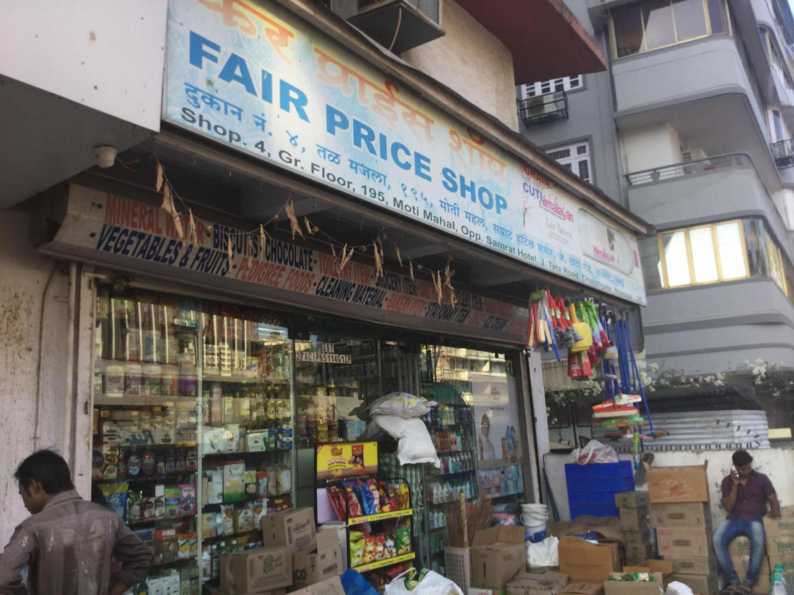
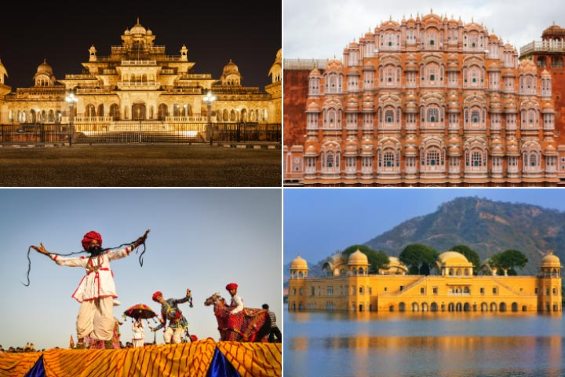
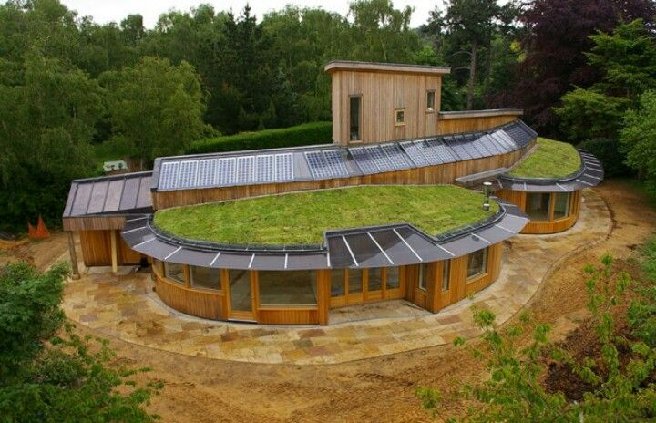

\newpage

\tableofcontents

```{r setup, include=FALSE}
knitr::opts_chunk$set(echo = TRUE)
```


\newpage

> # Abstract

Data Collection and Analysis is the Task-B for the FOSSEE summer fellowship. In this task we collected data related to 21 variables from various government departments and district collectorate. Then we cleaned the data and performed our analysis on it. 

\newpage
> # Introduction 

## Jaipur - An Overview 

Jaipur is the capital and the largest city of the Indian state of Rajasthan. As of 2011, the city had a population of 3.1 million, making it the tenth most populous city in the country. Jaipur is also known as the Pink City, due to the dominant colour scheme of its buildings. It is located 268 km (167 miles) from the national capital New Delhi.
Jaipur was founded in 1727 by the Rajput ruler Jai Singh II, the ruler of Amer, after whom the city is named. It was one of the earliest planned cities of modern India, designed by Vidyadhar Bhattacharya. During the British Colonial period, the city served as the capital of Jaipur State. After independence in 1947, Jaipur was made capital of the newly-formed state of Rajasthan.
Jaipur is a popular tourist destination in India and forms a part of the west Golden Triangle tourist circuit along with Delhi and Agra (240 km, 149 mi). It is home to two UNESCO World Heritage Sites - the Jantar Mantar and the Amer Fort. It also serves as a gateway to other tourist destinations in Rajasthan such as Jodhpur (348 km, 216 mi), Jaisalmer (571 km, 355 mi), Udaipur (421 km, 262 mi), Kota (252 km, 156 mi) and Mount Abu (520 km, 323 mi). Jaipur is located 616 km from Shimla.

source: [@jp]


\newpage
># GDP

Rajasthan is a mineral-rich state and has a diversified economy having agriculture, mining and tourism as its main engines of growth. The state mines produce gold, silver, sandstone, limestone, marble, rock phosphate, copper and lignite[@economy]. The average income of the Jaipur district depends on various sources such as *agriculture*, *forest*, *logging*, *fisheries*, *mining* etc.

```{r echo=FALSE,warning=FALSE,message=FALSE,error=FALSE}

ai=read.csv("agriincome.csv",header = TRUE)
plot.default(ai,type = 'o',xlab = "Year",ylab = "Income in Lakhs")
title("Income Through Agriculture")

```

## Analysis 
The above figure shows the income of Jaipur district through agriculture which is a considerable source of income in primary sector for the recent years.We see from the graph that the income of people decreases from 2012 to 2013 and hit lowest in 2013. After that increase in income is shown in next years and went highest in 2016.

## Conclusion 
 In Jaipur, the tertiary (services) sector contributed the maximum share of
46.2% to Gross District Domestic Product (GDDP) compared to Rajasthan's share of 57.2% to GSDP in 2009-10. The district's secondary (industrial) sector contributes less than 1/3rd
to GDDP (27.3%) while the contribution to primary sector is 26.5%. The GDDP of
Jaipur in tertiary sector is lower compared to that in Rajasthan.

Net District Domestic Product (NDDP) of Jaipur district was Rs. 34,79,199 (18.16% of the state's production) and Per Ca pita Income (PCI) of Rs. 55378. This is
also attributable to the district having a larger than proportional population. In Jaipur, agriculture forming the major share (87%) of income in the primary sector, 9.25% of NDDP. The largest share of the secondary sector output is derived from the secondary sector (42.5%) - this also reflects the urbanized nature of
Jaipur district, banking and other financial services are the largest of the contributors (21%) to the tertiary sector(12% of NDDP) in Jaipur


\newpage
> # Unemployment and Crimes in Jaipur

Employment plays an important role in the economic development of a country. The per capita income is the key factor determining the financial development of a nation. Although it has been proclaimed that Unemployment leads to increase in the crime rate, but in the case of Jaipur district it can be seen that number of crimes commited are less correlated to the number of unemployed citizens.

```{r echo=FALSE,warning=FALSE,message=FALSE,error=FALSE}
library(knitr)
cd=read.csv("crimedata.csv",header = TRUE,sep = ",")
ud=read.csv("unemployment.csv",header = TRUE,sep = ",")
plot(ud$year,ud$total, type = "o",xlab = "Year",ylab="Count of Crimes and Unemployed", col = "blue")
lines(cd$year,cd$total, type = "o", pch = 22, lty = 2, col = "red")
legend("topright", c("Unemployment", "Crimes"), cex = 0.8, col = c("blue", "red"), pch = 21:22, 
       lty = 1:2)
title(main = "Crimes and Unemployed in Jaipur District", font.main = 4)

```

## Analysis 

The above figure shows the number of unemployed citizens and crimes that took place in the past years.
The unemployment in recent years have been declined subsequently. The major decline took place from the year 2014 to 2015 which was 26.42% reduction in the number of unemployed citizens whereas the number of crimes committed have increased to a very small amount in the year 2012-13 and 2013-14 and reduced slightly in the year 2014-15 and 2015-16. But the overall crimes commited don't show significant rise or downfall.


The following table shows the different levels of education of the unemployed Jaipurites. 
`r kable(ud,caption="Education of Unemployed Crowd") `

## Conclusion
There has been no significant change when it comes to crimes in Jaipur. Crimes have been steady over the past years showing slight increase in 2014 and then slight decrease thereafter.Level of crimes is moderate in Jaipur, it is rarely directed toward foreigners. The most common types of crime are theft, armed robbery, and harassment. While visiting suburbs be cautious, as it's very easy to get lost, particularly during the dusk. Losing your way at night might be a panic-inducing situation. Jaipur is the 113Th safest country in the world, based on the safest and most dangerous countries ranking.   
Since there have been considerable decrease in the number of unemployed over the past years it could be seen as the reason for having a steady crime rate which is at least not getting hiked. 

 ***
\newpage
># Fair Price Shops in Jaipur

Government of India manages food economy through various measures. One such is the **Public Distribution System (PDS)** which evolved over time as the system for managing scarcity by the distribution of food grains at affordable price. It is **operated under the joint responsibility of the Central and the State Governments.** The responsibility for procurement, storage, transportation and bulk allocation of food grains has been assumed by the Central Government, through Food Corporation of India (FCI) to the State Governments. Various **operational responsibilities including allocation within State, identification of eligible families, issue of Ration Cards and supervision of the functioning of Fair Price Shops (FPSs), etc.,** rest with the State Governments. Main commodities namely wheat, rice, sugar, and kerosene are being allocated to the States/UTs for distribution under the Public Distribution System (PDS).

These commodities are distributed to the ration card holders under the **Targeted Public Distribution System** by means of Fair Price Shops. A **Fair Price Shop is a shop which has been licensed to distribute essential commodities to any ration card holder.** Hence, it an essential component of the Public Distribution System (PDS). Due to which Fair Price Shops are established in every district in India to ensure ease in the distribution of essential commodities.

```{r echo=FALSE, out.height = "300px"}
library(knitr)

fps=read.csv("fps.csv",header = TRUE)
kable(fps)

```

## Analysis 
There are total 1787 Fair price Shops in Jaipur District and 19,14,222 ration card holders.
There are more than 4 lakh fair price shops all over India making it the largest distribution system of this type in the world.

## Conclusion 
The basic objective of the strategy of PDS in India as in any
other developing mixed economies is to supply food grains and other
essential commodities to the poor and vulnerable section at fair prices. The
strategy has been to effect the distribution of food grains and other
essential commodities through a system of partial rationing. This is done
through "Fair price shops" at a price lower than those ruling in the open
market. Ideally, such a policy is directed towards providing essential
commodities for the weaker and vulnerable sections of the society.


  


***
\newpage
> # Courts in Jaipur

The Indian Judiciary administers a common law system of legal jurisdiction, in which customs, precedents and legislation, all codify the law of the land. It has in fact, inherited the legacy of the legal system established by the then colonial powers and the princely states since the mid-19th century, and has partly retained characteristics of practices from the ancient and medieval times. 
There are various levels of judiciary in India - different types of courts, each with varying powers depending on the tier and jurisdiction bestowed upon them. They form a strict hierarchy of precedence, in line with the order of the courts in which they sit, with the Supreme Court of India at the top, followed by High Courts of respective states with district judges sitting in District Courts and Magistrates of Second Class and Civil Judge (Junior Division) at the bottom. source: [@cor]


```{r echo=FALSE , comment=NULL,warning=FALSE}
library(knitr)
hc=read.csv("highcourt.csv",header = TRUE,sep = ",")
dc=read.csv("districtcourts.csv",header = TRUE,sep = ",")
barplot(c(hc$over10,hc$over5,hc$less5),names.arg = c("above 10","5 to 10","0 to 5"),main = "Cases Pending in High Court",col=c( "#6E8DAB", "#3F6D9B", "#104E8B"),xlab = "Years",ylab = "Cases Pending")
```


## Analysis

Figure shows the cases pending for more than 10 years, from 5 to 10 years and less than 5 years in high court.
\newline
From total `r paste(round(hc$final/100000,digits=2),"Lakh") `  cases there were `r paste(round(hc$over10/1000,digits=2),"thousand") ` cases that were pending from more than 10 years, `r paste(round(hc$over5/1000,digits=2),"thousand") ` cases that were pending from more than 5 years and `r paste(round(hc$less5/100000,digits=2),"Lakh") ` cases that were pending for less than 5 years.

Whereas in District courts there were `r paste(round(dc$cases/100000,digits=2),"Lakh") ` cases pending and `r paste(round(dc$new/100000,digits=2),"Lakh") ` new cases arrived. Resolved cases in District Court reached `r paste(round(dc$solved/100000,digits=2),"Lakh") ` resulting to final number of `r paste(round(dc$final/100000,digits=2),"Lakh") ` cases.
[@courts]

## Number of Judges in Jaipur District

As on December 2017, the number of vacancies in the Rajasthan state district and subordinate courts was 101. Against sanctioned strength of 1223 only 1122 were working. The judges strength in the high court as on 
December 2016 was 35 against the sanctioned strength of 50 which has further depleted to 25 in December 2017.

## Conclusion 
There is a huge mismatch in human resource and physical infrastructure to deal with ever increasing number of cases. On an average 10000 new cases add on the existing bundle of pending cases every year in the district and subordinate courts.

***
\newpage

> # Fire Incidents in Jaipur

 Fire accidents are something very common these days. They occur due to various factors- mishandling, faulty connections, overheating, short circuiting leakage etc. When they take place, they cause great alarm and destruction and sometimes loss of life. Fire accident occurs mostly due to carelessness. It generally happens in Summer Season.

```{r echo=FALSE, warning=FALSE , comment=NULL}
library(knitr)
fire<-read.csv("firestations.csv",header = TRUE,sep=",")
kable(fire,caption="Data of fire incidents that took place" )

```


## Analysis

Out of the 13 fire stations 11 stations come under Jaipur Nagar Nigam(JNN). There are total 40 motors and 20 machines. There are total 382 workers,out of which 238 are on permanent basis.

One fire station come under Nagrik suraksha with 2 motors and 4 machines. There are 17 permanent workers out of total 23 workers and had handled 28 fire incidents that took place in the district.

And the last fire station come under directorate having 1 motor and 4 machines for fire extinguishing. The cost for the machines is Rs. 1.33 Lakhs. There are 19 permanent workers amongst 33 total helpers. 

## Conclusion 
As per the latest news for the year 2016 there were total `r sum(fire['fire']) ` fire incidents that took place in the Jaipur district causing the loss of total `r paste("Rs.",round(sum(fire[,7])/10000000,digits=2),"Crore") ` in Indian rupees.

***
\newpage
> # Electricity in Jaipur

India's electricity sector is dominated by fossil fuels, and in particular, coal, which during the 2017-18 fiscal year produced about three-fourths of the country's electricity. However, the government is pushing for increased investment in renewable energy. The National Electricity Plan of 2018, prepared by the Government of India, states that the country does not need additional non-renewable power plants in the utility sector until 2027, with the commissioning of 50,025 MW coal-based power plants under construction and achieving 275,000 MW total installed renewable power capacity after the retirement of nearly 48,000 MW old coal-fired plants. 

```{r echo=FALSE,comment=NULL,warning=FALSE}
library(knitr)
connection=read.csv("electricity.csv",header = TRUE,sep = ",")
names(connection) <- gsub("X", " ", names(connection))
kable(connection,caption="Electricity Connections For Different Purposes")

```


## Analysis

We can see from the table that maximum electricity connection are taken for household purposes then for commercial purposes followed by irrigation. And minimum connections are taken for lighting purposes. 


```{r echo=FALSE,comment=NULL,warning=FALSE}
plot(c(2012,2013,2014,2015,2016),connection[8,2:6]/100000,type = 'o',ylab = "Electricity Connections (in Lakhs)",xlab = "Year")
title(main = "Electricity Connections", col.main = "black", font.main = 4)

```

The above figure shows the increase in Electricity connections over past few years. It can be seen that the increase in the total electricity connections have been increasing linearly till 2015 but hat a substantial increase from 2015 to 2016.

```{r echo=FALSE,comment=NULL,warning=FALSE}
library(knitr)
units=read.csv("electricityunits.csv",header = TRUE)
names(units) <- gsub("X", " ", names(units))
kable(units,caption="Electricity Units in kWh For Different Purposes")
```


We can see from the table that maximum electricity consumption are done in industrial purposes then for household  purposes followed by irrigation. And minimum consumption are done by lighting purposes. 


```{r echo=FALSE,comment=NULL,warning=FALSE}
plot(c(2012,2013,2014,2015,2016),units[8,2:6]/1000,type = 'o',ylab = "Electricity Units(in 1000KW)",xlab = "Year",col = "black")
lines(c(2012,2013,2014,2015,2016),units[1,2:6]/1000, type = "o", pch = 22, lty = 2, col = "red")
lines(c(2012,2013,2014,2015,2016),units[2,2:6]/1000, type = "o", pch = 22, lty = 2, col = "blue")
lines(c(2012,2013,2014,2015,2016),units[3,2:6]/1000, type = "o", pch = 22, lty = 2, col = "deeppink")
lines(c(2012,2013,2014,2015,2016),units[4,2:6]/1000, type = "o", pch = 22, lty = 2, col = "darkorange")
lines(c(2012,2013,2014,2015,2016),units[5,2:6]/1000, type = "o", pch = 22, lty = 2, col = "darkorchid")
lines(c(2012,2013,2014,2015,2016),units[6,2:6]/1000, type = "o", pch = 22, lty = 2, col = "brown1")
lines(c(2012,2013,2014,2015,2016),units[7,2:6]/1000, type = "o", pch = 22, lty = 2, col = "cyan")
#legend("topright", units$customer, cex = 0.8, col = c("black", "red","blue","deeppink","darkorange","darkorchid","brown1","cyan"), pch = 21:22, 
 #      lty = 1:2)
title(main = "Electricity Units in kWhr", col.main = "black", font.main = 4)
 
```

## Conclusion

The consumed electricity is non-linearly distributed over the time(in years). That is consumption is not correlated to the connections rather the scope of use of electricity.
From the above figure it could be seen that the maximum share of the total electricity consumed is by -  \newline
1. Industry \newline
2. Households \newline
3. Irrigation \newline


***
\newpage
> # Healthcare in Jaipur

India has a vast health care system, but there remain many differences in quality between rural and urban areas as well as between public and private health care. Despite this, India is a popular destination for medical tourists, given the relatively low costs and high quality of its private hospitals.

```{r echo=FALSE,comment=NULL,warning=FALSE}

d=read.csv("doctors.csv",header = TRUE)
x=colSums(d[2:6])
barplot(x,main = "No. of Doctors in Jaipur District",names.arg = c(2012,2013,2014,2015,2016),ylim = c(0,max(x)+1000),xlab = "Year",ylab = "Doctors"
        ,col = c( "#CCCCCC", "#9DACBB", "#6E8DAB", "#3F6D9B", "#104E8B"))


```

## Analysis
The above graph shows that the number of doctors were increased in year 2014 and 2015 but then number get decreased in year 2016. 

## Conclusion 
This decrease in number is not good for the district as in case of need for healthcare people are forced to go to other cities for healthcare facilities. 

From the screening for non-communicable diseases(NCD's) in seven districts of Rajasthan, conducted by health department has found that Jaipur is most vulnerable to diseases such as Diabetes and hypertension.

As per the figures collected so far, 1.23 lakh people were screened for hypertension and 17,300 of them showed signs of hypertension. Almost 14% of the population was found vulnerable to hypertension.

Out of the 68,510 people screened for diabetes, 11,100(over 16%) showed symptoms of diabetes.


***
\newpage
> #  Tourism in Jaipur

Improved infrastucture,new attractions and night tourism gave a fresh impetus to monuments in the pink city which received record number of tourists in Dec. 2017.


```{r echo=FALSE, out.height = "300px"}

```


## Amber Fort
The sentinel of the iconic walled city, remain the pivotal attraction in December,2017 with visitors numbers growing at a record 28.76% compare to the same period last year

source: [@af]

## Nahargarh Fort
Nahargarh Fort stands on the edge of the Aravalli Hills, overlooking the city of Jaipur in the Indian state of Rajasthan. Along with Amer Fort and Jaigarh Fort, Nahargarh once formed a strong defense ring for the city. The fort was originally named Sudarshangarh but it became known as Nahargarh, which means 'abode of tigers'. The popular belief is that Nahar here stands for Nahar Singh Bhomia, whose spirit haunted the place and obstructed construction of the fort.

source: [@nf]

## Jaigarh Fort
Jaigarh Fort is situated on the promontory called the Cheel ka Teela (Hill of Eagles) of the Aravalli range; it overlooks the Amer Fort and the Maota Lake, near Amer in Jaipur, Rajasthan, India.
The fort was built by Jai Singh II in 1726 to protect the Amer Fort and its palace complex and was named after him.

source: [@jf]

## Hawa Mahal
The Hawa Mahal in Jaipur is considered as one of the most iconic attractions of the city. The five-storey building looks like a honeycomb of a beehive and it is always windy inside, owing to the numerous windows and jharokhas. This amazing ventilation that the palace enjoys is the reason why it was named as the Hawa Mahal, which literally translates into the "Palace of the Winds". 

source: [@hm]


```{r echo=FALSE,warning=FALSE}
library(knitr)
tt=read.csv("jptourists.csv",header = TRUE)
kable(tt,caption = "Number of tourists that visit Jaipur")
```


## Analysis
Tourism is a significant contributor to the Indian economy Breakdown of Indian GDP by industry Annual international tourist arrivals in India sector and the foreign exchange earnings.

Rajasthan attracts approximately one quarter of all arrivals in India.
Jaipur remains one of the major tourist destinations in the regional International tourists arrivals.

Almost 60% international tourists come from Europe and spend over $200 in Jaipur during an average stay of 2.8 days.
We have  month-wise number of Indian and Foreign tourists arrived in Jaipur from 2001 to 2017.  

```{r echo=FALSE,warning=FALSE,error=FALSE}
library(ggplot2)
library(reshape)
tour_data<-read.csv(file = "JaipurDistrictTourismData.csv", header = TRUE)
names(tour_data) <- gsub("X", " ", names(tour_data))


tour_data.m <- melt(tour_data, id.vars = c("Months","Type"))
ggplot(data = tour_data.m , aes(x=(factor(Months, levels = month.name)), 
                                y=variable, fill=value, factor(Type))) + 
  geom_tile()+
  scale_fill_gradient(low = "#C6DBEF", high = "#08306B") + 
  facet_grid(cols = vars(Type)) +
  xlab("Months") +
  ylab("Years")+
  theme(axis.text.x=element_text(angle=90,hjust=1))+
  ggtitle("Jaipur Tourism Data Comparison")
```

In the heat map above, more intensity means more number of tourists.

## Conclusion 
If we look at the number of tourists overall we can easily see that number of Indian tourists are far more than Foreigner tourists which is quite obvious.
And Number of Foreign tourists in January, February, March, April, October, November and December are significantly more than the rest of the year. and this is because these months are the cold days of winter season which is preferred by Foreigners as in non winter days the temperature is very high in Jaipur.
And for the same reason Indian Tourists also prefer to travel in cold days.

***
\newpage
># Industries in Jaipur

```{r echo=FALSE,warning=FALSE,error=FALSE}

industries<- read.csv(file = "NoOfIndustries.csv", header = TRUE)
characteristic_of_industries<- read.csv(file = "CharateristicsOfIndustries.csv", header = TRUE)


industries_data_cleaned<-industries[1:26,]


names(industries_data_cleaned) <- gsub("\\.", " ", names(industries_data_cleaned))
names(characteristic_of_industries) <- gsub("\\.", " ", names(characteristic_of_industries))
#names(Education_data_cleaned)

```


```{r echo=FALSE,warning=FALSE,error=FALSE}
library(ggrepel)
theme_set(theme_bw())
p <- ggplot(industries_data_cleaned, aes(x=industries_data_cleaned$Industries, y=industries_data_cleaned$`at the end of the year`), label = rownames(industries_data_cleaned)) + 
  geom_point(size=3, color = "red") + 
  geom_segment(aes(x=industries_data_cleaned$Industries, 
                   xend=industries_data_cleaned$Industries, 
                   y=0, 
                   yend=industries_data_cleaned$`at the end of the year`) 
                   ) + 
  labs(title="No of Industries Registered in the District",x="Industries",
       y="Number of Industries" 
  ) 

p + geom_text_repel( 
  label = industries_data_cleaned$Industries,
  nudge_y      = 0.05, size=2.5,
  direction    = "x",
  angle        = 90,
  vjust        = 0,
  segment.size = 0.1
)+
  theme( 
    axis.line.x  = element_blank(),
    axis.ticks.x = element_blank(),
    axis.text.x  = element_blank(),
    axis.title.x = element_blank()
  )

```


## Analysis
In the year, 2686 number of Manufacture of other Non-Metallic Mineral Products industries were registered which was maximum for the year and Civil Engineering Work,Water Transport,Waste Collection, Treatment & Disposal activities,Repair & Installation of Machinery Equipment were the minimum number of companies registered with 1, 2, 7 and 9 industries registered respectively.  

The Nonmetallic Mineral Product Manufacturing sub sector transforms mined or quarried nonmetallic minerals, such as sand, gravel, stone, clay, and refractory materials, into products for intermediate or final consumption. Processes used include grinding, mixing, cutting, shaping, and honing. Heat often is used in the process and chemicals are frequently mixed to change the composition, purity, and chemical properties for the intended product.


## Conclusion 
The abundant availability of raw materials like sand, gravel, stone and  clay in the Jaipur region make it possible for Jaipur to achieve maximum establishment of The Non-metallic Mineral Product Manufacturing  industries. And unavailability of resources for Civil Engineering Work, Water Transportation , Waste Collection, Treatment & Disposal activities ,Repair & Installation of Machinery Equipment resulted into lowest establishment of these industries.  

***
\newpage
># Swachh Bharat Mission Implementation in Jaipur

The Swachh Bharat Mission (SBM) emanates from the vision of the Government articulated in the
address of The President of India in his address to the Joint Session of Parliament on 9th June
2014: "We must not tolerate the indignity of homes without toilets and public spaces littered with
garbage. For ensuring hygiene, waste management and sanitation across the nation, a "Swachh
Bharat Mission" will be launched. This will be our tribute to Mahatma Gandhi on his 150th birth
anniversary to be celebrated in the year 2019."
SBM is being implemented by the Ministry of Housing and Urban Affairs (M/o HUA) and by the
Ministry of Drinking Water and Sanitation (M/o DWS) for urban and rural areas respectively. These
guidelines are for the implementation of Swachh Bharat Mission (Urban).
source: [@sbm]

```{r echo=FALSE,warning=FALSE,error=FALSE}
swachh<- read.csv(file = "JaipurDistrictSwatchBharatMission.csv", header = TRUE)
```
Here we have number of IHHL(Individual Household Latrine) installed under Panchyat of different Blocks in Jaipur.

```{r echo=FALSE,warning=FALSE,error=FALSE}
#swachh<-swachh[1:390,]
#plot1
theme_set(theme_bw())
g <- ggplot(swachh, aes(swachh$IHHLTotalAch)) + scale_fill_brewer(palette = "Spectral")


#plot1
g <- ggplot(swachh, aes(swachh$IHHLTotalAch))
g + geom_density(aes(fill=factor(swachh$BlockName)), alpha=0.8) + 
    labs(title="Total IHHL Built in Different Blocks in Jaipur",x="IHHL",fill="blocks")

#plot2
g <- ggplot(swachh, aes(swachh$BlockName, swachh$IHHLTotalAch,fill=BlockName))
g + geom_violin() + 
  labs(title="Violin Plot for Different blocks ",x="blocks",y="total IHHL") +
  theme(axis.text.x = element_text(angle=80, vjust=0.6))
```

## Analysis 
The Panchayat MANHORPUR in SHAHPURA Block has the highest number of IHHL installed which is 7864.
and the Panchayat LADA KA BAS in PAOTA Block has the lowest number of IHHL installed which is 218.

## Conclusion 
The blocks which are nearer to main Jaipur City have more number of IHHL. As the distance of blocks from Jaipur City increases the number of IHHL decreases. This means either government policies impart less effect on areas away from city or government policies take more time to implement in areas away from main city.


***
\newpage
># BPL Households in Jaipur

Below Poverty Line is an economic benchmark used by the government of India to indicate economic disadvantage and to identify individuals and households in need of government assistance and aid. It is determined using various parameters which vary from state to state and within states. The present criteria are based on a survey conducted in 2002. Going into a survey due for a decade, India's central government is undecided on criteria to identify families below poverty line. 
Internationally, an income of less than $1.90 per day per head of purchasing power parity is defined as extreme poverty. By this estimate, about 12.4% of Indians are extremely poor. Income-based poverty lines consider the bare minimum income to provide basic food requirements; it does not account for other essentials such as health care and education. 
source: [@bpl]


Here we have total number of BPL families and NON BPL families for all the blocks in Jaipur.

```{r echo=FALSE,warning=FALSE,error=FALSE}
BPL<-read.csv(file = "JaipurBPL.csv", header = TRUE)

#**Cleaning of the data**
 #we see that there are unnecessary "." in columns 
 #so now we remove these extra "."

names(BPL) <- gsub("\\.", " ", names(BPL))
```

```{r echo=FALSE,warning=FALSE,error=FALSE}
# Plot
theme_set(theme_classic())
BPL<-BPL[order(BPL$`Number of families BPL`),]
BPL$Panchayat<- factor(BPL$Panchayat, levels = BPL$Panchayat) 
ggplot(BPL, aes(x=BPL$Panchayat, y=value)) + 
  geom_point(aes(y = BPL$`Number of families BPL`, col = "`Number of families BPL`"),size=3) + 
  geom_point(aes(y = BPL$`Number of families Non BPL`, col = "`Number of families Non BPL`"),size=3)+
  geom_segment(aes(x=BPL$Panchayat, 
                   xend=BPL$Panchayat, 
                   y=min(BPL$`Number of families BPL`), 
                   yend=max(BPL$`Number of families Non BPL`)), 
               linetype="dashed", 
               size=0.1) +   # Draw dashed lines
  labs(title="BPL and Non-BPL Families in Jaipur District",x="Panchayats in Jaipur District",y="Number of Families") +  coord_flip()

```


## Analysis
Maximum Number of BPL families are in Shahpura and least number of families in BPL is in Jhotwara.
In all the blocks number of non-bpl families are more then bpl families.

## Conclusion 

In all the blocks in Jaipur number of families above BPL is significantly more than number of families in BPL.
If we look at the location  of these places then we find out that blocks that are near to Jaipur city have less families in BPL and blocks away from Jaipur have more families in BPL. That ultimately shows that below poverty households are less in urban areas as compaed to rural areas.


***
\newpage
> # College Data

Poornima College Of Engineering 

PCE, the pioneer institute of PGC was established in 2000 with the aim of imparting pragmatic technical education. In its magnificent journey of 18 years, PCE has set benchmark and reached at new pinnacles in engineering education with dedication, perseverance and devotion. PCE is spearheading its outstanding voyage with motto as 'Success is not a destination, it's a journey'. NBA Accreditation in CE, EE & ECE department established PCE as leading institution of National repute.

```{r echo=FALSE,error=FALSE,warning=FALSE,comment=NULL}
library(knitr)
clg=read.csv("college.csv",header = TRUE)
kable(clg,caption = "Students in Different Departments")


```


## Analysis 
Poornima College Of Engineering has maximum students in Electrical Engineering which is 720 students and has minimum students in Information Technology which is 240 students.

## Campus Boundary


```{r echo=FALSE, out.height = "300px"}
knitr::include_graphics("pce.jpg")
```

## Location
Poornima Group of Colleges (PGC) ISI-2, RIICO Institutional Area Sitapura, Jaipur - 302022


***
\newpage
> # Green Roof Initiative and Rain Water Harvesting 

## Green Roof Initiative

The historic city of Jaipur in Rajasthan has turned greener during 4-7 October 2017, when green building thought leaders, CEO s, practitioners, technology providers, national and international stakeholders from the construction industry and other sectors converged in Jaipur to discuss and deliberate various emerging green building concepts, trends and technologies at Green Building Congress 2017- India's annual flagship event on green buildings. The theme for the 15Th edition is 'Sustainable-built environment for all'.

```{r echo=FALSE, out.height = "300px" , fig.align="centre"}

```

## Rain Water Harvesting

All the 145 houses in Jhunjhunu's Ismailpur village have built a 13-foot-deep underground tank which can store 20,000 liters of rainwater. The tank is charged with rooftop water during the monsoon through pipes. Every member of a family of six (average size) uses his share of eight liters per day with a self-discipline which helps the family keep the stock going till the next monsoon
Harvesting rainwater in such tanks has inspired 20 other villages around Ismailpur.

A report of an expert committee on the Integrated Development of Water Resources in Rajasthan said in 2013, over 24 cities and towns received government water only once every four days. According to the report, more than 75% of Indian villages with multiple water quality problems fall in Rajasthan

Families also recharge the groundwater with soak pits in their houses. They have dug up a 19-foot hole in their house and put 15 cement rings of three-foot diameter for used water of the house, from the kitchen and the bathroom, to flow into the ground

***
\newpage
> # Population in Jaipur

India is the second most populated country in the world with nearly a fifth of the world's population. India has more than two thousand ethnic groups, and every major religion is represented, as are four major families of languages (Indo-European, Dravidian, Austroasiatic and Sino-Tibetan languages) as well as two language isolates (the Nihali language spoken in parts of Maharashtra and the Burushaski language spoken in parts of Jammu and Kashmir (Kashmir). Further complexity is lent by the great variation that occurs across this population on social parameters such as income and education. Only the continent of Africa exceeds the linguistic, genetic and cultural diversity of the nation of India. source: [@pop]
 
## Population of Jaipur
```{r echo=FALSE}
library(knitr)
pop<-read.csv("population.csv",header = TRUE)
kable(pop,caption = "Population in rural and urban areas")

```


## Analysis
In both 2001 and 2011 female population has been less then male population. And also, number of female populations in rural area has been more then the number of female populations in urban area in both 2001 and 2011. 

## Conclusion 
There has not been much change in the female to male ratio in past years. Females to male ratio in rural areas has decreased and in urban areas this ratio has increased. The overall female to male ratio has been increased.


***
\newpage
> # Education in Jaipur

Education in India is provided by public schools (controlled and funded by three levels: central, state and local) and private schools. Under various articles of the Indian Constitution, free and compulsory education is provided as a fundamental right to children between the ages of 6 and 14. The approximate ratio of public schools to private schools in India is 7:5.


```{r echo=FALSE,warning=FALSE,comment=FALSE}

library(knitr)
edu=read.csv("education.csv",header = TRUE,sep=",")
edus=read.csv("educationstudent1.csv",header=TRUE)
kable(edu,caption="colleges,schools and universities in Jaipur District")
plot(edu$year,edu$total,type='o',col='red',xlab = "Year",ylab="No of institutes")
kable(edus,caption = "Total number of Male and female students studying in educational institutes")
title("Total Educational Institutes in Jaipur District")
par(mfrow=c(2,3))
plot(edu$year,edu$colleges,type = 'o',col='blue',xlab = "Year",ylab="No of institutes")
title("Colleges in Jaipur District")
plot(edu$year,edu$highsecondaryschools,type = 'o',col='blue',xlab = "Year",ylab="No of institutes")
title("High Secondary Schools in Jaipur")
plot(edu$year,edu$highprimaryschools,type = 'o',col='blue',xlab = "Year",ylab="No of institutes")
title("High Primary Schools in Jaipur")
plot(edu$year,edu$primaryschools,type = 'o',col='blue',xlab = "Year",ylab="No of institutes")
title("Primary Schools in Jaipur")
plot(edu$year,edu$polytechnical,type = 'o',col='blue',xlab = "Year",ylab="No of institutes")
title("Polytechnical Institutes in Jaipur")
plot(edu$year,edu$iti,type = 'o',col='blue',xlab = "Year",ylab="No of institutes")
title("ITI in Jaipur District")

```


## Analysis 
*Teachers*
Jaipur has a total of 23415 teachers employed in its Govt. schools, of which 13736 are male and 9679 are female. Amber (890) employs the lowest number of
teachers among all blocks, of which 348 are female teachers. In the elementary category, Jaipur has a total of 22970 teachers, of which 9480 are female and
13490 are male.

District Jaipur has teachers with degree B..Ed. 8.85%, teachers with B.Ed. or equivalent degree 76.70% and Other qualification 13.96%.

```{r echo=FALSE,warning=FALSE,message=FALSE,error=FALSE}
#install.packages("ggplot2")
#install.packages("ggcorrplot")
#install.packages("ggrepel")
library(ggplot2)
library(lattice)
library(dplyr)        #for filter
library(ggcorrplot)   #for ggcorrplot
library(scales)
library(magrittr)
library(reshape2)
library(ggrepel)

```

```{r echo=FALSE,warning=FALSE,error=FALSE}
Education_data<- read.csv("JaipurEducationData.csv", header = TRUE)
Edu_data<- read.csv(file = "JaipurEducationSector.csv", header = TRUE)
Education_data_cleaned<-Education_data[1:14,]
names(Education_data_cleaned) <- gsub("\\.", " ", names(Education_data_cleaned))
Education_data_cleaned$Blocks<-gsub("\\#|\\^|\\*", " ", Education_data_cleaned$Blocks)

#View(Education_data_cleaned)
theme_set(theme_bw())  # pre-set the bw theme

gg <- ggplot(Education_data_cleaned, aes(x=Education_data_cleaned$`No  of schools having AWCs`, y=Education_data_cleaned$`Total students`)) + 
  geom_point(aes(col=`No  of schools having AWCs`, size=`Total students`)) + 
  geom_smooth(method="loess", se=F) + 
  labs(title="No. of Schools Having AWCs vs Total Student", 
       y="Total Student", 
       x="No. of Schools Having AWCs" 
       )
plot(gg)
```

In Jaipur District Jamwa Ramgarh has the maximum number of AWCs (Angan Wadi Center) which is 357 and Amber has the minimum number of AWCs with 149 AWCs.
Whereas when it comes to number of students, Jaipur city has 62724 number of students which is higest number of student in a block.

```{r echo=FALSE}
Edu_data<-Education_data_cleaned[,c("Blocks","Boys student","Girls students")]
colnames(Edu_data)<-c("Block","Girl","Boy")
ggplot(melt(Edu_data, id.vars='Block'), aes(x=Block, y=value, fill=variable)) + 
  geom_bar(stat='identity', position='dodge') + 
  labs( title= "Number of Students in Different Blocks in Jaipur",x="Blocks",y="Number of Students") +
  theme(axis.text.x = element_text(angle=60, hjust=1)) 

```
We can easily see that in every block the number of girl student is less than the number of boy student. 
and Jaipur City Block has the maximum number of girl and boy students.
and Amber has the minimum number of girl and boy students.

## Conclusion
Like any other dist. or state in our country the situation of female participation in Educaiton sector is similar as in Jaipur dist. which is very low as compared to male participation. 
More encouragement needs to be done to increase female participation which is very important as *"NO nation can rise to the heights of glory unless your women are side by side with you"*-Muhammad Ali Jinnah

***
\newpage
> # Green Coverage in Jaipur

## Forests and Grasslands
About 5% of the total area of the district was under forest. Subsidiary graphically types of dry tropical forest are found in the district where Dhok or Dhokra is the most common tree. Other species found are Adossa, Gurjan, Salar, Jhingha, Babul, Siris, Bar, Gular, Pipal, Shisham Peelu, Hingota, Karaya, Khejra, Kair and Jamun. The timber obtained from the forest fof the district is utilized for the manufacture of agriculture implements besides being used for roofing as well as for fuel purpose.

## Temperature

```{r echo=FALSE,warning=FALSE,comment=FALSE}

library(knitr)
tem=read.csv("temphumidity.csv",header = TRUE)
kable(tem,caption = "Temperature (in Celsius) and Humidity (in gram/meter^3) of Jaipur")
plot(tem$year,tem$avgtemp,col="blue",type='o',xlab = "Year",ylab = "Average Temperature")
title("Average Temperature of Jaipur (in Celsius")

```

## Conclusion
From the above graph it could be seen that the average temperature is increasing substantially every year.Hence we can predict that Jaipur is more prone to natural calamities like drought and landslides and preventive measures should be taken to preserve the environment.


***
\newpage
> # KCC in Jaipur

**KCC** stands for Kisan Credit Card.The Kisan Credit Card (KCC) is a credit delivery innovation for providing adequate and timely credit to farmers under a single window with a flexible and simplified procedure. The KCC has been an important instrument for deepening financial inclusion in recent years. As at end-March 2011, about 10.2 million KCCs were issued while the amount of agricultural credit outstanding against them was Rs. 726 billion. Commercial banks, with a share of 55 per cent in total cards issued and 69 per cent in the total amount of credit played an important role in expanding the KCC route to credit.
\newline
In the sustained growth of agricultural sector, credit plays a
crucial role. The agriculture and allied sector contributed 14.6
per cent to the gross domestic product (GDP at constant price),
58.2 per cent to employment and 10.6 per cent to national exports
in 2009-10. Considering the problems being faced by the
farmers in having access to credit, the Government of India
introduced the Kisan Credit Card (KCC) scheme in the year
1998-99 to provide timely and adequate credit support to the
farmers from formal banking system in a flexible, hassle-free
and cost effective manner 

```{r echo=FALSE,warning=FALSE,error=FALSE}
library(knitr)
kcc=read.csv("kcc.csv",header = TRUE)
kcc1=read.csv("kcc1.csv",header = TRUE)
kable(kcc,caption = "credit flow under agriculture")
kable(kcc1,caption = "credit flow under KCC")

```

The above tables shows the Share of KCC in the total credit advances to agricultural sector: 2000-01 to 2010-11 (Amount in Rs. Crore)

## Conclusion
The number of
cards issued in India has recorded the growth rate of 3.3 per cent
during the period 2001- 02 to 2010-11. The North-East region
recorded the highest growth rate (16.0%) in number of cards
issued and in amount advanced (34.4%) during this period. The
amount per account advanced under KCC was Rs.36800 in India
during 2010-11. Only two regions, namely Northern (Rs.
104200) and Western (Rs. 84500) had a higher amount per
account than all- India average. The Northern region recorded a
higher growth rate (17.5%) of amount per account advanced
under KCC, while it was lowest for Western region (6.9%) The
institution-wise analysis of the performance of KCC revealed
that at all-India level RRBs showed the highest growth rate for
the number of cards issued. In the case of cooperative banks,
North-Eastern region showed the highest growth rate for the
number of cards issued (9.7%) and amount sanctioned (19.7%)
which was higher than all-India level as well. In the case of
RRBs, the growth rate for number of cards issued and amount
sanctioned were highest for the Eastern region, followed by
North- Western region (18.4%), followed by Eastern region
(16.4%). The commercial banks also showed the highest growth
rate for the number of cards issued, amount sanctioned and
amount per account for the North-Eastern region, followed by
Western region for the number of cards issued, and Eastern
region for the amount advanced. Thus, the performance of KCC
scheme varies widely across regions of the country and across
financial institutions. The Eastern and North-Eastern regions
continue to be under performers with respect to Kisan Credit
Card Scheme

source: [@kcc]

***
\newpage
> # Loans Issued in Jaipur

```{r echo=FALSE}

loan<-read.csv("loan.csv",header = TRUE)

plot(loan$year,loan$loangiven,xlab = "Year",ylab = "Amount (in Rs.)", type = "o", col = "blue")
lines(loan$year,loan$loanpaid, type = "o", pch = 22, lty = 2, col = "red")
lines(loan$year,loan$loanunpaid.inlakhs., type = "o", pch = 22, lty = 2, col = "green")
legend("topleft", c("loan given", "loan paid","loan unpaid"), cex = 0.8, col = c("blue", "red","green"), pch = 21:22, 
       lty = 1:2)


```

## Analysis
The number of loan takers increases after 2014. It reached to its maximum heights in 2015 then again it started decreasing. There always been less people whose loans are unpaid then those whose loans are paid.


## Conclusion
The above graph shows the year wise loans given to the farmers, loan paid back by the farmers and loan unpaid by the farmers (in lakhs). 
The maximum amount of loan issued to the farmers was in the year 2015 with the amount of `r paste(round(loan[4,'loangiven']/100, digits=2)) ` crores.
During this year only there was considerable increase in the loans being issued to farmers.


***
\newpage
> # Krishi Vigyan Kendra in Jaipur

Krishi Vigyan Kendra, Chomu (Jaipur) is run by Pragati Trust-Jaipur, a reputed voluntary organization established in 1993. The KVK is an innovative transfer of technology project is responsible for identifying and developing new technologies, according to local need and potential to increase the agriculture production and provide the basis for agro-based agriculture development, so as to increase per unit production under Crops, Livestock production, Dairy, Horticulture and allied Agriculture enterprises and ultimate to help the farmers in improving their living standard.

KVK is situated at Village Tankarda on Chomu-Renwal road 40 km away from District Headquarter and linked with Jaipur-Bikaner National Highway.

Operational area of this KVK encompasses 7 Development Blocks namely Govindgarh, Sambher, Dudu, Jhotwara, Sanganer, Phagi & Chaksu.

Thrust Areas\newline
1. Agricultural Production as prime goal.\newline
2. Increasing Crop Production through improved agriculture techniques\newline
3. Sustainable Crop Production through Integrated Nutrient Management\newline
4. Popularization of Hi-Tech Horticulture\newline
5. Increasing area under dry land and horticulture crops\newline
6. Integrated Pest Management in Crops and Vegetables\newline
7. Water harvesting & water management techniques\newline
8. Production and distribution of quality seed & planting material\newline
9. Increasing productivity of Dairy Animals through Breeding, Feeding & Health Management\newline
10. Diversification through horticultural and medicinal crops\newline
11. Value addition & post harvest technology of agro and milk products\newline
12. Women empowerment through self help groups & income generating activities \newline
13. Popularization of organic farming for sustainable agriculture \newline
14. Popularizing of back yard poultry farming and goatry among weaker section \newline
15. Reclamation of problematic soils through use of soil amendments

source : [@kvk]

***
\newpage
> # Irrigation in Jaipur


```{r echo=FALSE,warning=FALSE,comment=FALSE}
library(knitr )
irrigation=read.csv("irrigatedland.csv",header = TRUE,sep=",")
kable(irrigation,caption = "irrigated land(in hectare) by natural sources")
plot(irrigation$year,irrigation$total,xlab = "Year",ylab = "Land (in hectare)",type = 'o',col="red")
title(main="Irrigated Land(in hectare) Through Natural Sources")


#pie(c(sum(irrigation['well']),sum(irrigation['pond']),sum(irrigation['neher']),sum(irrigation['others'])))
#pie(c(sum(energy['dieseltubewell']),sum(energy['electricitytubewell'])))
#pie(c(sum(energy['dieselpumpingset']),sum(energy['electricitypumpingset'])))


```

```{r echo=FALSE,warning=FALSE,comment=FALSE}
library(knitr )
energy=read.csv("irrigatedlandthroughenergy.csv",header = TRUE,sep = ",")
kable(energy,caption = "Irrigated land through electricity and diesel")
plot(energy$year,energy$total1,xlab = "Year",ylab = "Land (in hectare)", type = "o", pch = 22, lty = 2, col = "blue")
title(main="Irrigated Land(in hectare) Through Tubewell")
```


## Analysis 
The above figure shows the irrigated land (in hectare) through tube well. The maximum land irrigated through tube well is operated through electricity.
`r paste(round(sum(energy$dieseltubewell)*100/sum(energy$total1), digits=2))` % of the land irrigated through tube well are diesel operated and rest
`r paste(round(100-sum(energy$dieseltubewell)*100/sum(energy$total1),digits = 2))` % are electricity operated.

```{r echo=FALSE,warning=FALSE,comment=FALSE}
energy=read.csv("irrigatedlandthroughenergy.csv",header = TRUE,sep = ",")
plot(energy$year,energy$total2,xlab = "Year",ylab = "Land (in hectare)", type = "o", pch = 22, lty = 2, col = "blue")
title(main="Irrigated Land(in Hectare) Through Pumping Set")
```

The above figure shows the irrigated land (in hectare) through pumping set. The maximum land irrigated through pumping set is operated through electricity.
`r paste(round(sum(energy$dieselpumpingset)*100/sum(energy$total2),digits=2)) `% of the land irrigated through pumping set are diesel operated and rest 
`r paste(round(100-sum(energy$dieselpumpingset)*100/sum(energy$total2) ,digits=2)) `% are electricity operated.

## Conclusion 
Due advancement in technology the irrigation of land through natural sources has increased in recent years. Whereas the irrigation through traditional methods like tube well has increased quite earlier. Increase in using of these methods for irrigation started in 2013 and then became constant.
The increase in irrigation through pumping set started from 2014 and has kept on increasing ever since. Irrespective of the method the area of irrigated land is increasing which is good news. 


***
\newpage
> # Vehicles in Jaipur

```{r echo=FALSE,comment=FALSE,warning=FALSE}
library(knitr)
vehicle=read.csv("vehicle.csv",header = TRUE,sep = ",")
kable(vehicle)
plot(c(2012,2013,2014,2015,2016),vehicle[14,2:6]/100000,type = 'o',ylab = "Total Vehicles (in Lakhs)",xlab = "Year",col="green")
title(main = "Total Vehicles in Jaipur", col.main = "black", font.main = 4)


```


## Analysis
Maximum number of vehicles in Jaipur are two wheelers, which has been consistent over the past years. And least number of vehicles in Jaipur have been Motor Rikshaw. 

## Conclusion 
The above figure shows that there has been linear increase in the number of vehicles in the Jaipur District in the recent past years.
Jaipur is one of the world's most polluted cities. Apart from the poisonous air, being a pedestrian is potentially dangerous because vehicle riders and drivers, battle it out on the roads oblivious to India's road rules and the rights of pedestrians.


\newpage

#References

