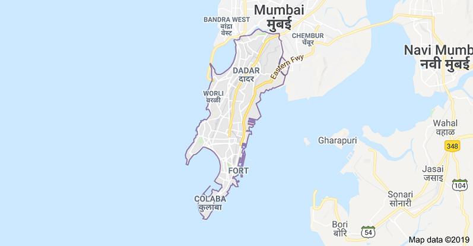

```{r,echo=FALSE,warning=FALSE,fig.align = "center"}
knitr::include_graphics("FOSSEE.png")
  

```


```{r,echo=FALSE,warning=FALSE,fig.align = "center"}
knitr::include_graphics("IIT_Bombay.png")
```
\newpage

\tableofcontents

\newpage

> Abstract

In this report, data from the various government departments of Coimbatore district were collected by visiting respective departments in person and by searching for required data on online government portals. Data included in this report are on **Population of the Area** and **Industries**. Collected data was analyzed and conclusions were drawn. Analysis was done completely using a **Free-Libre / Open Source Software (FLOSS)** known as **'R'** as a part of **[FOSSEE](https://fossee.in/) Project** by **IIT Bombay** and **MHRD, Government of India.** [FOSSEE](https://fossee.in/) project is part of the National Mission on Education through ICT with the thrust area being adaptation and deployment of open source simulation packages equivalent to proprietary software, funded by MHRD, based at the Indian Institute of Technology Bombay (IITB).


\newpage

>#1.) Introduction


Mumbai (also known as Bombay, the official name until 1995) is the capital city of the Indian state of Maharashtra.

Mumbai lies on the Konkan coast on the west coast of India and has a deep natural harbor. In 2008, Mumbai was named an alpha world city. It is also the wealthiest city in India and has the highest number of millionaires and billionaires among all cities in India.

The seven islands that came to constitute Mumbai were home to communities of fishing colonies of the Koli people. For centuries, the islands were under the control of successive indigenous empires before being ceded to the Portuguese Empire and subsequently to the East India Company when in 1661 Charles II of England married Catherine of Braganza and as part of her dowry, Charles received the ports of Tangier and Seven Islands of Bombay. During the mid-18th century, Bombay was reshaped by the Hornby Vellard project, which undertook reclamation of the area between the seven islands from the sea. Along with construction of major roads and railways, the reclamation project, completed in 1845, transformed Bombay into a major seaport on the Arabian Sea. Bombay in the 19th century was characterized by economic and educational development. During the early 20th century it became a strong base for the Indian independence movement. Upon India's independence in 1947 the city was incorporated into Bombay State. In 1960, following the Samyukta Maharashtra Movement, a new state of Maharashtra was created with Bombay as the capital.


source: [@mum]

```{r,echo=FALSE,warning=FALSE,fig.align = "center"}

```

|                                     *Fig: Map of Mumbai District *

\newpage

>#2.) Population 

1 of every 6 people on the planet live in India, and between the 2001 and 2011 censuses, the country grew by 17.7%, adding 181.5 million people. The country has doubled in size in just 40 years and is expected to unseat China as the world's most populated country in the next couple of decades. India's current yearly growth rate is 1.02%.

The country as a whole has a population density of 416 people per square kilometer, which ranks 31st in the world. In Mumbai, the population density is 21,000 people per square kilometer (54,000/square mile).

source: [@pop]

###Total Population 

```{r echo=FALSE,warning=FALSE,message=FALSE,error=FALSE}
library("ggplot2")  # Data visualization
library("dplyr")    # Data manipulation

totalpop<-read.csv("total.csv")

totalpop <- totalpop %>%
  arrange(desc(Gender)) %>%
  mutate(lab.ypos = cumsum(Population) - 0.5*Population)

mycols <- c("#0073C2FF", "#EFC000FF")

ggplot(totalpop, aes(x = 2, y = Population, fill = Gender)) +
  geom_bar(stat = "identity", color = "white") +
  coord_polar(theta = "y", start = 0)+
  geom_text(aes(y = lab.ypos, label = Population), color = "white")+
  scale_fill_manual(values = mycols) +
  labs(title = "Total Population of the District")+
  theme_void()+
  xlim(0.5, 2.5)


```
We can observe from the above donut plot that the male population of the district is 86,40,419 and the female population of the district is 47,41,720. There are just 55 females on every 100 males. The female to male ratio of the district is very low.

###Scheduled Caste and Scheduled Tribe 

The Scheduled Castes (SCs) and Scheduled Tribes (STs) are officially designated groups of historically disadvantaged people in India. The terms are recognized in the Constitution of India and the groups are designated in one or other of the categories. For much of the period of British rule in the Indian subcontinent, they were known as the Depressed Classes.

Since the independence of India, the Scheduled Castes and Scheduled Tribes were given Reservation status, guaranteeing political representation. The Constitution lays down the general principles of positive discrimination for SCs and STs. Pallan of Tamil Nadu is considered the oldest community of Schedule Castes, perhaps in all of India.


```{r echo=FALSE,warning=FALSE,message=FALSE,error=FALSE}


caste<-read.csv("caste.csv")

caste <- caste %>%
  arrange(desc(Caste)) %>%
  mutate(lab.ypos = cumsum(Population) - 0.5*Population)

mycols2<- c("#0073C2FF", "#EFC000FF", "#868686FF", "#CD534CFF")

ggplot(caste, aes(x = "", y = Population, fill = Caste)) +
  geom_bar(width = 1, stat = "identity", color = "white") +
  coord_polar("y", start = 0)+
  geom_text(aes(y = lab.ypos, label = Population), color = "white")+
  scale_fill_manual(values = mycols2) +
  labs(title="Scheduled Caste in the District")+
  theme_void()


```

###Conclusion 

We can conclude from the above pie chart that Mumbai has more population of Scheduled Caste than Scheduled Tribe. The male population in both Scheduled Caste and Scheduled Tribe is more than the female population. There are 90 Scheduled Caste females on every 100 Scheduled Caste males and 88 Scheduled Tribe females on every 100 Scheduled Tribe males.
Female to male ratio is much better in Scheduled Caste and Scheduled Tribe than the total population of Mumbai. 

\newpage

>#2.) Industry 

Four key industrial economic sectors are identified in India. The primary sector, largely extract raw material and they are mining and farming industries. In the secondary sector, refining, construction, and manufacturing are included. The tertiary sector deals with services and distribution of manufactured goods. India's service industry accounts for 57.2% of the country's GDP while the industrial and agricultural sector contributes 28% and 14.6% respectively. Agriculture is the predominant occupation in India, accounting for about 52% of direct and indirect employment. The service sector makes up a further 34% and industrial sector around 14%. The labour force totals around half a billion workers. Industry accounts for 28% of the GDP and employs 14% of the total workforce.

source: [@indus]

```{r echo=FALSE,warning=FALSE,message=FALSE,error=FALSE}
library(reshape2)

industry<-read.csv("Industry.csv",header =TRUE)
colnames(industry)<-c("PrincipalCommodity","2012","2013")
ggplot(melt(industry, id.vars='PrincipalCommodity'), aes(x=PrincipalCommodity, y=value, fill=variable)) + 
  geom_bar(stat='identity', position='dodge') + 
  labs(title="Commodity Values ", 
       y="Value (in Crore)", 
       x="Principal Commodity",fill="Year"
       ,caption = "Please Ref. Below Table for Abbreviations ")+
  theme(axis.text.x = element_text(angle=60, hjust=1)) 


```

*Table: Abbreviations regarding Principal Commodity *

```{r,echo=FALSE,warning=F}
library(knitr)
# Creating table.
abb<-read.csv("abb.csv")
knitr::kable(abb, format = "markdown")

```


###Conclusion 

The above bar graph concludes that in the year 2012, the value of almost every commodity for different industries is mostly less than 2000 crores and limited commodities have value above 6000 crores. For the year 2013, the number of commodities having a commodity value less than 2000 crores has decreased and commodities having commodity value more than 6000 crores has increased. Thus, suggesting a better market in 2013. 


\newpage

#References